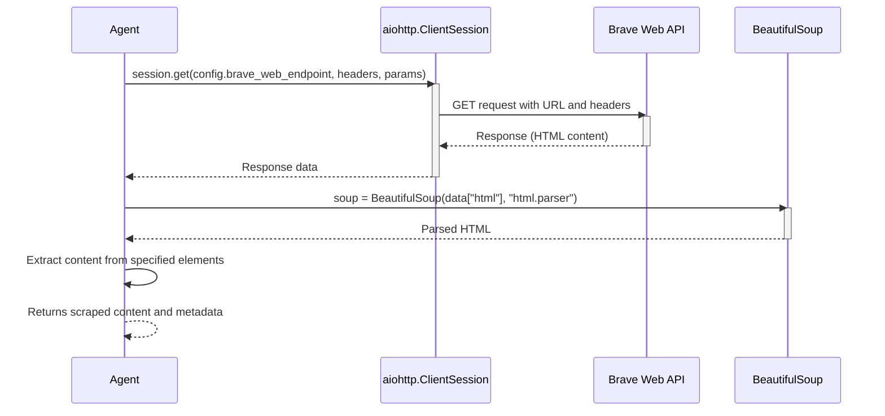
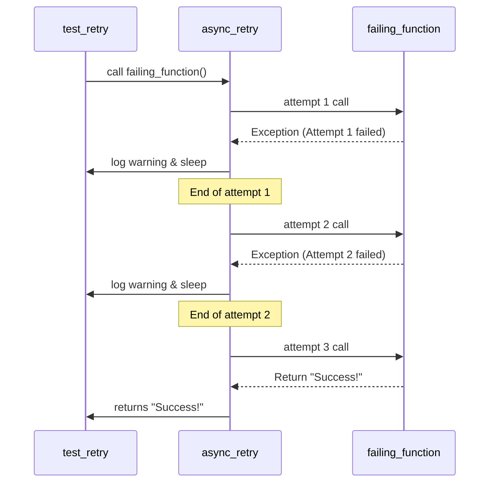

# Agent Tools Module

[code:agent/tools/search/providers/jina.py]

[code:agent/tools/search/providers/searxng.py]

[code:agent/tools/search/providers/brave.py]

[code:agent/tools/search/providers/__init__.py]

[code:agent/tools/search/providers/composite.py]

[code:agent/tools/search/factory.py]

[code:agent/tools/search/base.py]

[code:agent/tools/search/__init__.py]

[code:agent/tools/generators/base_generator.py]

[code:agent/tools/generators/txt_generator.py]

[code:agent/tools/generators/json_generator.py]

[code:agent/tools/generators/__init__.py]

[code:agent/tools/generators/generator_factory.py]

[code:agent/tools/extractors/csv_extractor.py]

[code:agent/tools/extractors/base_extractor.py]

[code:agent/tools/extractors/pdf_extractor.py]

[code:agent/tools/extractors/__init__.py]

[code:agent/tools/extractors/extractor_factory.py]

[code:agent/services/qdrant.py]

[code:agent/services/postgres.py]

[code:agent/services/__init__.py]

[code:agent/reflection/critique.py]

[code:agent/reflection/feedback.py]

[code:agent/reflection/evaluator.py]

[code:agent/reflection/__init__.py]

[code:agent/checkpoints/persistence.py]

[code:agent/checkpoints/recovery.py]

[code:agent/checkpoints/versioning.py]

[code:agent/checkpoints/__init__.py]

[code:agent/utils/logging.py]

[code:agent/utils/error_handling.py]

[code:agent/utils/cache.py]

[code:agent/utils/proxy.py]

[code:agent/utils/http.py]

[code:agent/utils/langgraph_adapter.py]

[code:agent/utils/extraction.py]

[code:agent/utils/async_utils.py]

[code:agent/utils/retry_stats.py]

[code:agent/utils/company_extraction.py]

[code:agent/utils/__init__.py]

[code:agent/prompts/validation.py]

[code:agent/prompts/templates.py]

[code:agent/prompts/research.py]

[code:agent/prompts/reflection.py]

[code:agent/prompts/__init__.py]

[code:agent/prompts/analysis.py]

[code:agent/tools/document_processor.py]

[code:agent/tools/code_executor.py]

[code:agent/tools/base.py]

[code:agent/tools/vizualization.py]

[code:agent/tools/human_feedback.py]

[code:agent/tools/scraper.py]

[code:agent/tools/storage.py]

[code:agent/tools/evaluator.py]

[code:agent/tools/__init__.py]

[code:agent/tools/mock_tools.py]

[code:agent/core/state.py]

[code:agent/core/graph.py]

[code:agent/core/agent.py]

[code:agent/core/__init__.py]

[code:agent/cli/visualize.py]

[code:agent/cli/__init__.py]

[code:agent/cli/run.py]

[code:agent/subgraphs/analysis_flow.py]

[code:agent/subgraphs/validation_flow.py]

[code:agent/subgraphs/research_flow.py]

[code:agent/subgraphs/__init__.py]

[code:agent/supervisors/team_supervisor.py]

[code:agent/supervisors/orchestrator.py]

[code:agent/supervisors/__init__.py]

[code:agent/supervisors/task_manager.py]

[code:agent/nodes/market.py]

[code:agent/nodes/validation.py]

[code:agent/nodes/research.py]

[code:agent/nodes/__init__.py]

[code:agent/nodes/analysis.py]

[code:agent/nodes/error.py]

[code:agent/nodes/main.py]

[code:agent/config/settings.py]

[code:agent/config/types.py]

[code:agent/config/__init__.py]

[code:agent/config/configuration.py]

[code:agent/examples/simple_graph.py]

[code:agent/examples/__init__.py]

[code:agent/constants.py]

[code:agent/log_config.py]

[code:agent/exceptions.py]

[code:agent/__init__.py]

## Overview

The Agent Tools module (`src/agent/tools.py`) provides specialized functions that enable the agent to interact with external systems, gather information, and perform specific operations. These tools are designed to extend the agent's capabilities beyond basic language processing.

## Primary Responsibilities

1. **Tool Definition**: Creating standardized tool interfaces for agent use
2. **External Integrations**: Providing access to external APIs and services
3. **Data Collection**: Gathering information from various sources
4. **Content Processing**: Transforming and analyzing gathered content
5. **Tool Registration**: Organizing tools for discovery and use by the agent

## Core Components

### Tool Registration System

The framework for defining and registering tools for agent use:

```python
def create_tool(func):
    """Decorator for creating a standardized tool from a function.
    
    This decorator transforms a regular function into a tool object that
    can be used by the agent. It preserves the function's docstring and
    type annotations for use in generating tool descriptions.
    
    Args:
        func: The function to convert into a tool
        
    Returns:
        Tool: The created tool object
    """
    # Extract function metadata
    name = func.__name__
    description = func.__doc__ or f"Tool for {name}"
    parameters = inspect.signature(func).parameters
    
    # Create schema for the tool
    schema = {
        "name": name,
        "description": description,
        "parameters": {
            "type": "object",
            "properties": {},
            "required": []
        }
    }
    
    # Process parameters to build the schema
    for param_name, param in parameters.items():
        if param_name == "self" or param_name == "cls":
            continue
            
        # Get type annotation if available
        param_type = "string"
        if param.annotation != inspect.Parameter.empty:
            if param.annotation == str:
                param_type = "string"
            elif param.annotation == int:
                param_type = "integer"
            elif param.annotation == float:
                param_type = "number"
            elif param.annotation == bool:
                param_type = "boolean"
                
        # Add parameter to schema
        schema["parameters"]["properties"][param_name] = {
            "type": param_type,
            "description": f"Parameter {param_name} for {name}"
        }
        
        # Add to required list if no default value
        if param.default == inspect.Parameter.empty:
            schema["parameters"]["required"].append(param_name)
    
    # Create the tool
    return Tool(
        name=name,
        description=description,
        func=func,
        schema=schema
    )
```

### Web Scraping Tool

A tool for retrieving and processing web content:

```python
@create_tool
async def web_scrape(url: str, elements_to_extract: Optional[List[str]] = None) -> Dict[str, Any]:
    """Scrape content from a web page.
    
    This tool retrieves the HTML content of a webpage and extracts
    the text content from specified elements. If no elements are specified,
    it extracts the main content automatically.
    
    Args:
        url: The URL of the webpage to scrape
        elements_to_extract: Optional list of CSS selectors to extract
        
    Returns:
        Dict[str, Any]: The scraped content and metadata
    """
    # Initialize configuration
    config = Configuration()
    
    # Prepare request parameters
    params = {
        "url": url,
        "timeout": config.web_scrape_timeout
    }
    
    # Set up headers
    headers = {
        "User-Agent": config.user_agent,
        "Accept": "text/html,application/xhtml+xml,application/xml",
        "Accept-Language": "en-US,en;q=0.9"
    }
    
    # Make the request to the web service
    async with aiohttp.ClientSession() as session:
        try:
            async with session.get(
                config.brave_web_endpoint,
                params=params,
                headers=headers,
                timeout=aiohttp.ClientTimeout(total=config.api_timeout)
            ) as response:
                if response.status != 200:
                    return {
                        "success": False,
                        "error": f"Failed to retrieve content: HTTP {response.status}",
                        "url": url
                    }
                    
                data = await response.json()
        except Exception as e:
            return {
                "success": False,
                "error": f"Request failed: {str(e)}",
                "url": url
            }
    
    # Parse the HTML content
    try:
        soup = BeautifulSoup(data["html"], "html.parser")
        
        # Extract content based on specified elements or default to main content
        content = ""
        if elements_to_extract:
            for selector in elements_to_extract:
                elements = soup.select(selector)
                for element in elements:
                    content += element.get_text(strip=True) + "\n\n"
        else:
            # Extract main content using common content selectors
            for selector in ["article", "main", ".content", "#content", ".post"]:
                elements = soup.select(selector)
                if elements:
                    for element in elements:
                        content += element.get_text(strip=True) + "\n\n"
                    break
                    
            # If no content found with common selectors, extract body content
            if not content:
                content = soup.body.get_text(strip=True)
                
        # Clean up the content
        content = re.sub(r'\s+', ' ', content).strip()
        
        return {
            "success": True,
            "content": content,
            "title": soup.title.string if soup.title else "",
            "url": url,
            "timestamp": datetime.now().isoformat()
        }
    except Exception as e:
        return {
            "success": False,
            "error": f"Parsing failed: {str(e)}",
            "url": url
        }
```

## Tool Categories

The Agent Tools module provides various categories of tools for different purposes:

### Research Tools

Tools for gathering information from external sources:

| Tool | Description |
|------|-------------|
| `web_scrape` | Retrieves and processes content from web pages |
| `web_search` | Performs web searches and returns relevant results |
| `document_retrieval` | Fetches documents from a document store |
| `knowledge_base_query` | Queries a structured knowledge base |

### Analysis Tools

Tools for processing and analyzing collected information:

| Tool | Description |
|------|-------------|
| `text_extraction` | Extracts specific information from text using rules or patterns |
| `sentiment_analysis` | Analyzes the sentiment of text content |
| `entity_extraction` | Identifies and extracts named entities from text |
| `summarization` | Creates concise summaries of longer content |

### Market Analysis Tools

Tools for gathering and analyzing market information:

| Tool | Description |
|------|-------------|
| `supplier_search` | Searches for suppliers in a specific category |
| `price_analysis` | Analyzes pricing information for products or services |
| `competitor_analysis` | Gathers information about competitors |
| `market_trends` | Identifies trends in specific market segments |

### Utility Tools

General-purpose utility tools for various operations:

| Tool | Description |
|------|-------------|
| `json_parser` | Parses and validates JSON data |
| `text_translator` | Translates text between languages |
| `currency_converter` | Converts between different currencies |
| `unit_converter` | Converts between different units of measurement |

## Web Scraping Process

The web scraping tool follows this sequence of operations, as illustrated in the diagram:



## Tool Implementation Details

### Tool Structure

Each tool follows a consistent structure:

1. **Function Definition**: The core functionality implemented as an async function
2. **Tool Decoration**: Using the `@create_tool` decorator to standardize the interface
3. **Documentation**: Comprehensive docstrings explaining purpose and usage
4. **Error Handling**: Robust error detection and reporting
5. **Result Formatting**: Consistent output structure

### Standard Tool Result Format

Tools return results in a standardized format:

```python
{
    "success": True,  # Boolean indicating success or failure
    "content": "...",  # The primary content or result
    "metadata": {      # Additional information about the result
        "source": "...",
        "timestamp": "2023-01-01T12:00:00Z",
        "confidence": 0.95
    },
    "error": None      # Error message if success is False
}
```

### Tool Registration Process

Tools are registered for agent use through these steps:

```python
def create_research_tools(config: Configuration) -> List[Tool]:
    """Create the set of research tools for the agent.
    
    This function creates and registers all the research tools that
    the agent can use during the research phase.
    
    Args:
        config: The configuration object with settings
        
    Returns:
        List[Tool]: The list of available research tools
    """
    tools = [
        web_scrape,
        web_search,
        document_retrieval,
        text_extraction,
        summarization
    ]
    
    # Apply any configuration-specific customization
    if config.enable_enhanced_search:
        tools.append(enhanced_web_search)
        
    if config.enable_knowledge_base:
        tools.append(knowledge_base_query)
        
    return tools
```

## Usage Examples

### Using Tools in Agent Nodes

```python
from agent.tools import create_research_tools

async def research_node(state: AgentState) -> AgentState:
    """Research node implementation using tools."""
    # Initialize configuration
    config = Configuration()
    
    # Initialize LLM
    llm = get_llm(config)
    
    # Create and bind tools
    tools = create_research_tools(config)
    llm_with_tools = llm.bind_tools(tools)
    
    # Execute tool-using chain
    result = await llm_with_tools.ainvoke({
        "input": "Research renewable energy technologies",
        "tools": tools
    })
    
    # Process tool results
    # ...
    
    return new_state
```

### Directly Calling Tools

```python
from agent.tools import web_scrape

async def process_website(url):
    """Process a website using the web_scrape tool."""
    # Call the web scrape tool directly
    result = await web_scrape(url=url)
    
    if result["success"]:
        # Process the scraped content
        content = result["content"]
        title = result["title"]
        print(f"Successfully scraped: {title}")
        return content
    else:
        # Handle the error
        print(f"Scraping failed: {result['error']}")
        return None
```

### Creating Custom Tools

```python
from agent.tools import create_tool

@create_tool
async def custom_data_processor(data: str, max_length: int = 1000) -> Dict[str, Any]:
    """Process custom data with specific business logic.
    
    This tool applies specialized processing to the input data
    and returns the results in a structured format.
    
    Args:
        data: The input data to process
        max_length: Maximum length of processed output
        
    Returns:
        Dict[str, Any]: The processing results
    """
    try:
        # Apply custom processing logic
        processed_data = some_processing_function(data)
        
        # Truncate if needed
        if len(processed_data) > max_length:
            processed_data = processed_data[:max_length] + "..."
            
        return {
            "success": True,
            "content": processed_data,
            "metadata": {
                "original_length": len(data),
                "processed_length": len(processed_data),
                "truncated": len(processed_data) > max_length
            }
        }
    except Exception as e:
        return {
            "success": False,
            "error": f"Processing failed: {str(e)}"
        }
```

## The Retry Mechanism

Tools often interact with external systems that may experience transient failures. The async_retry decorator provides resilience:



The implementation of this retry decorator:

```python
def async_retry(max_retries=3, base_delay=1, max_delay=60, backoff_factor=2):
    """Decorator for retrying async functions with exponential backoff.
    
    Args:
        max_retries: Maximum number of retry attempts
        base_delay: Initial delay between retries in seconds
        max_delay: Maximum delay between retries in seconds
        backoff_factor: Factor to increase delay with each retry
        
    Returns:
        Decorated function that will retry on failure
    """
    def decorator(func):
        @functools.wraps(func)
        async def wrapper(*args, **kwargs):
            retries = 0
            delay = base_delay
            
            while True:
                try:
                    return await func(*args, **kwargs)
                except Exception as e:
                    retries += 1
                    if retries > max_retries:
                        # Max retries exceeded, re-raise the exception
                        raise
                        
                    # Calculate delay with exponential backoff
                    delay = min(delay * backoff_factor, max_delay)
                    
                    # Log the failure and retry information
                    logger.warning(
                        f"Function {func.__name__} failed with {type(e).__name__}: {str(e)}. "
                        f"Retrying in {delay} seconds (attempt {retries}/{max_retries})."
                    )
                    
                    # Wait before retrying
                    await asyncio.sleep(delay)
        return wrapper
    return decorator
```

## Best Practices

1. **Error Handling**: Implement robust error handling in all tools
2. **Retry Logic**: Use the retry decorator for external API calls
3. **Asynchronous Design**: Design tools to be async for non-blocking operation
4. **Idempotency**: Ensure tools can be safely retried without side effects
5. **Comprehensive Documentation**: Provide detailed docstrings for all tools
6. **Result Standardization**: Follow the standard result format
7. **Rate Limiting**: Respect rate limits for external APIs
8. **Parameter Validation**: Validate all input parameters before processing
9. **Metrics Collection**: Include telemetry for monitoring tool performance
10. **Security Awareness**: Handle credentials and sensitive data properly

## Related Components

- **Graph Engine**: Uses tools during node execution
- **Configuration Module**: Provides settings for tools
- **State Management**: Stores tool results in the state
- **Prompt Management**: Contains prompts for tool use
- **Utility Functions**: Provides helper functions for tools 