# Architecture Flows

This document provides detailed flow diagrams illustrating the interactions, inputs/outputs, and dependencies for each component of the Agent System.

## Table of Contents

1. [Core Module Flows](#core-module-flows)
   - [Graph Building and Execution Flow](#graph-building-and-execution-flow)
   - [State Management Flow](#state-management-flow)
   - [Agent Interface Flow](#agent-interface-flow)
2. [Node Flows](#node-flows)
   - [Main Node Flow](#main-node-flow)
   - [Research Node Flow](#research-node-flow)
   - [Error Handling Flow](#error-handling-flow)
   - [Validation Node Flow](#validation-node-flow)
3. [Tool Integration Flows](#tool-integration-flows)
   - [Base Tool Execution Flow](#base-tool-execution-flow)
   - [Evaluator Tool Flow](#evaluator-tool-flow)
   - [Tool Registry Flow](#tool-registry-flow)
4. [Cross-Module Flows](#cross-module-flows)
   - [End-to-End Agent Execution](#end-to-end-agent-execution)
   - [Error Handling and Recovery Across Modules](#error-handling-and-recovery-across-modules)
   - [Tool to Node Integration Flow](#tool-to-node-integration-flow)

## Core Module Flows

This section shows the internal flows within each core module, illustrating how components within a module interact.

### Graph Building and Execution Flow

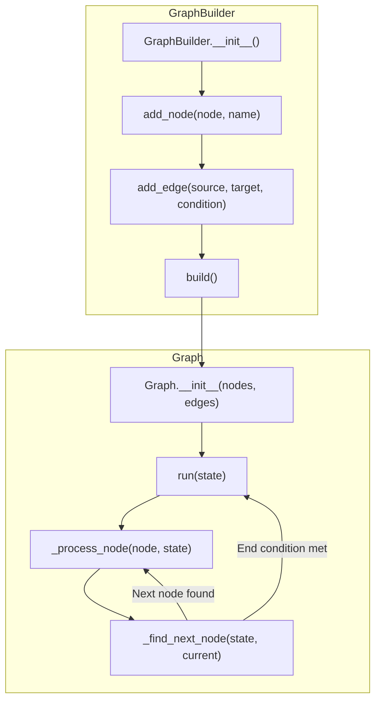

### State Management Flow

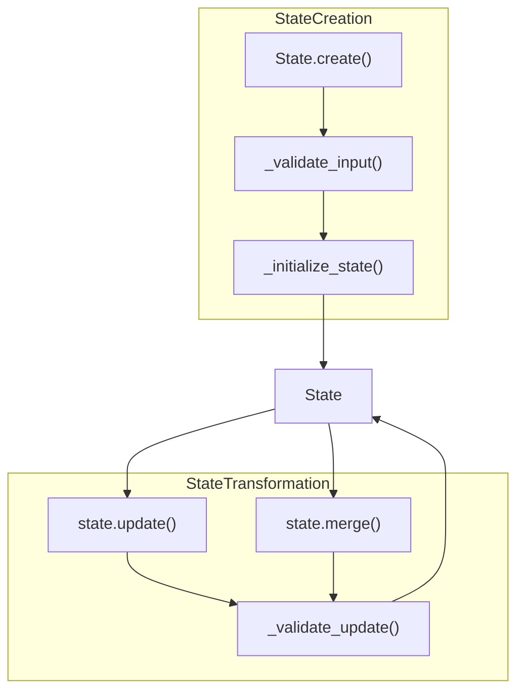

### Agent Interface Flow

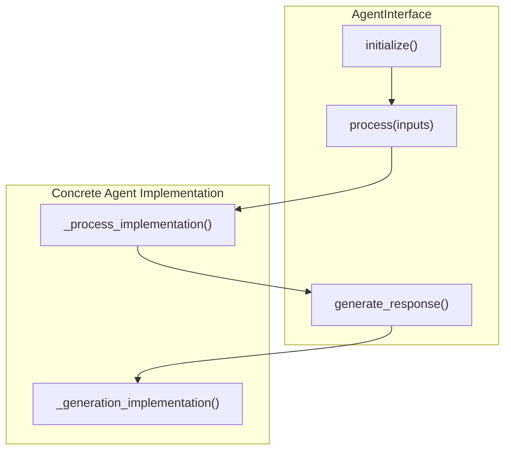

## Node Flows

This section shows the internal flows within different node types, illustrating how nodes process states.

### Main Node Flow

The flow of the main node processing:

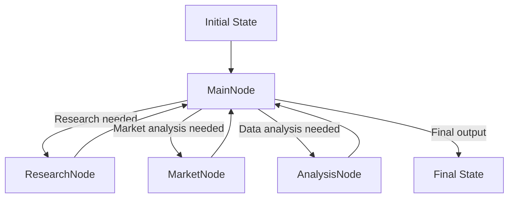

### Research Node Flow

The flow of the research node processing:

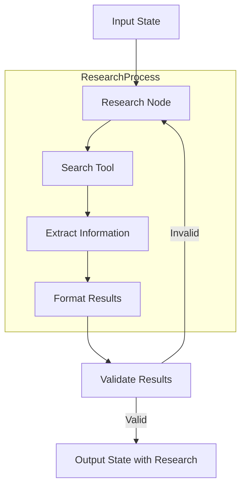

### Error Handling Flow

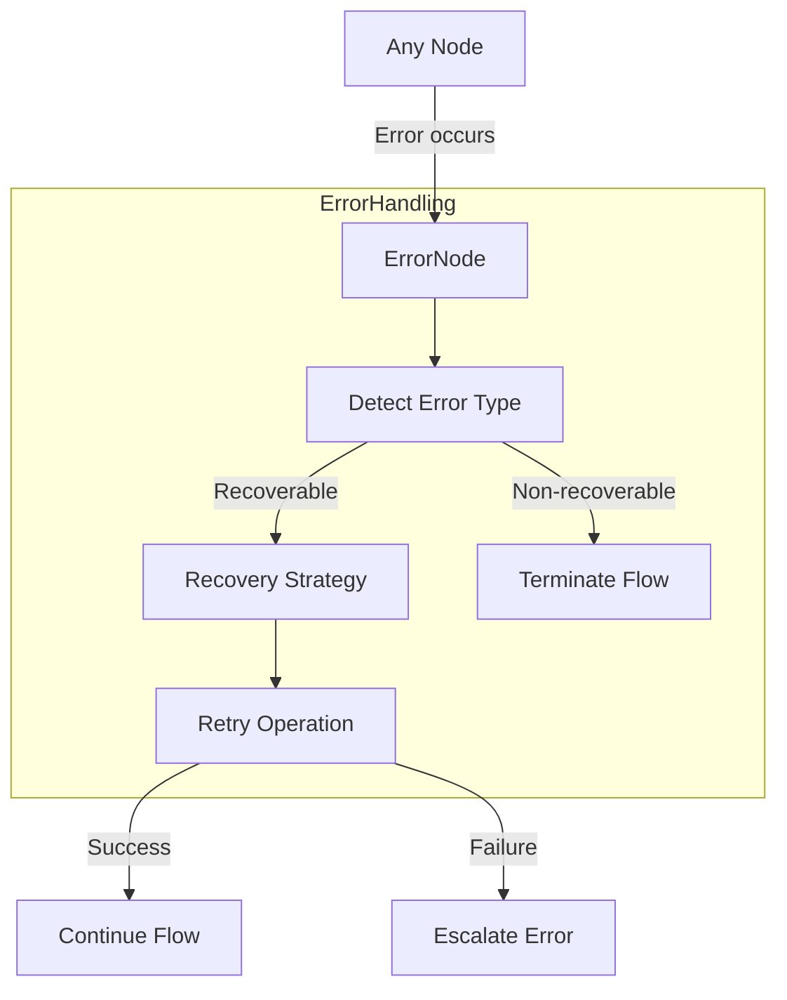

### Validation Node Flow

The flow of the validation node:

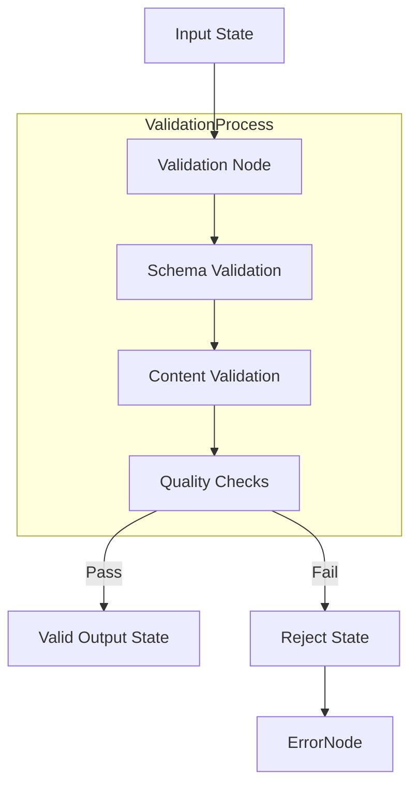

## Tool Integration Flows

This section shows the internal flows within tool integrations, illustrating how tools are used in the agent system.

### Base Tool Execution Flow

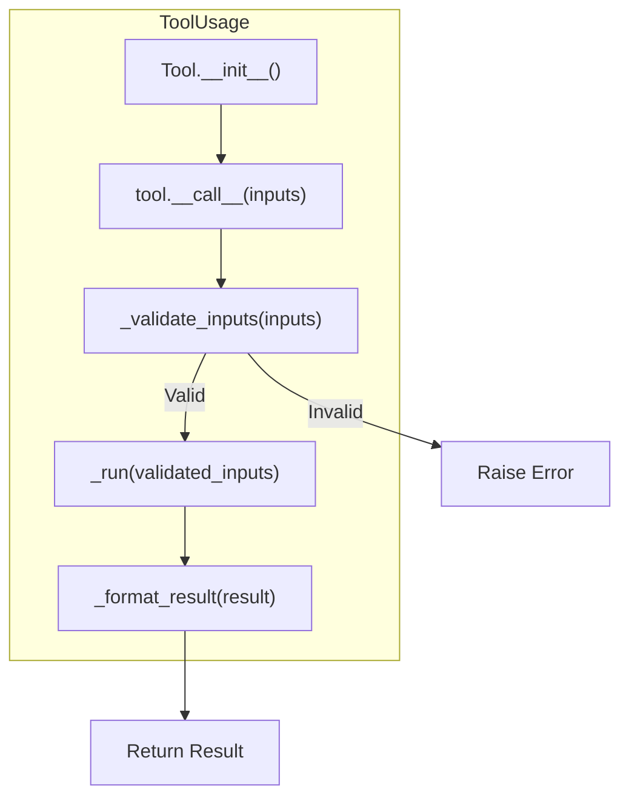

### Evaluator Tool Flow

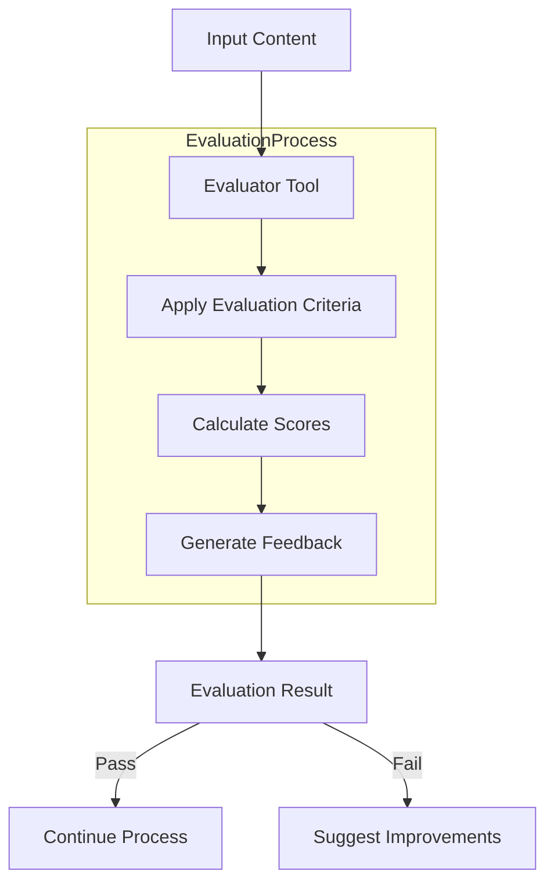

### Tool Registry Flow

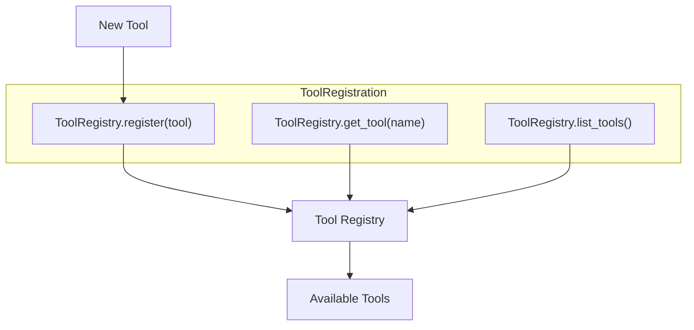

## Cross-Module Flows

This section illustrates how different modules interact with each other to accomplish system-level processes.

### End-to-End Agent Execution

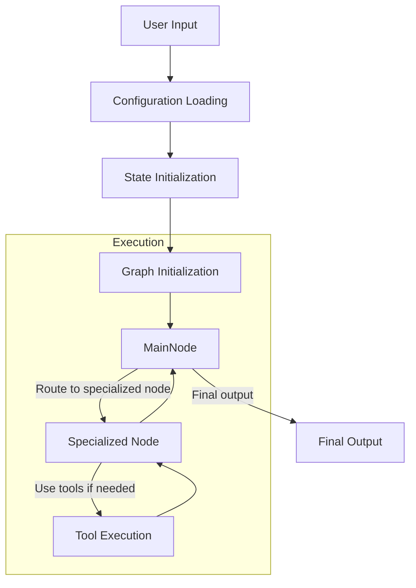

### Error Handling and Recovery Across Modules

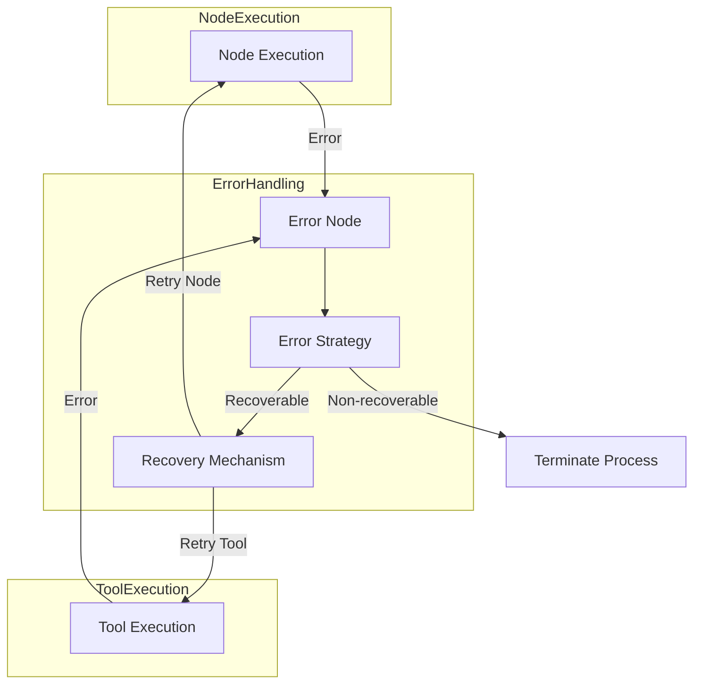

### Tool to Node Integration Flow

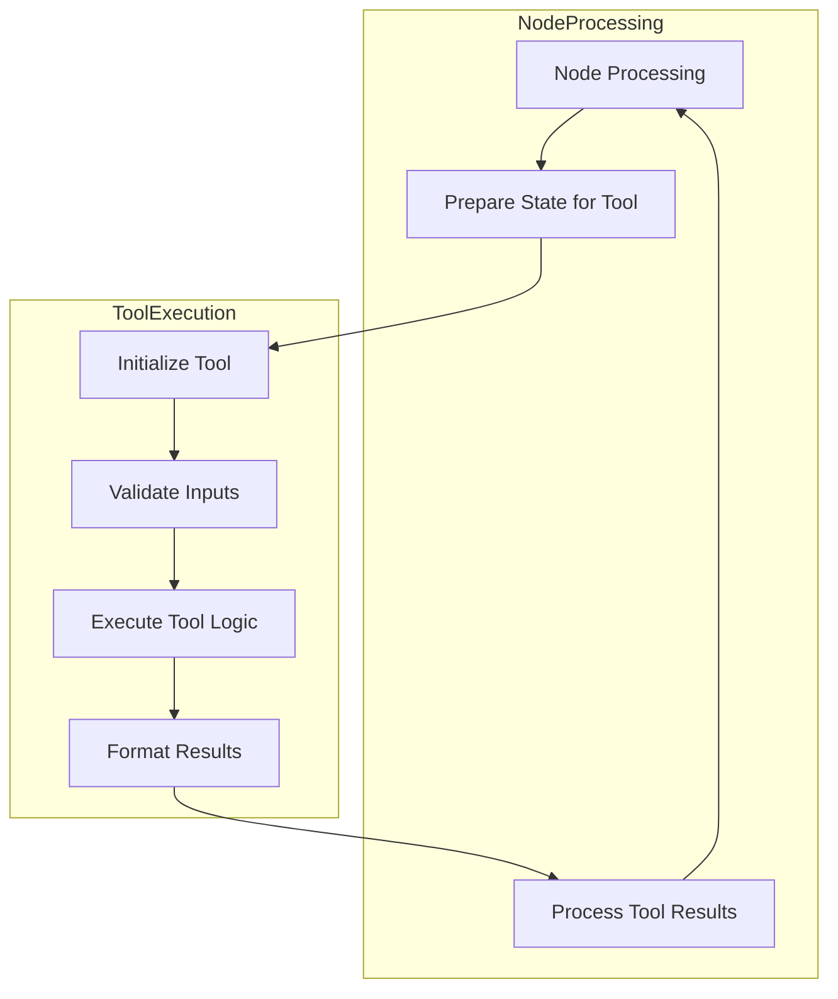

This documentation provides a comprehensive view of the agent system architecture through visual flow diagrams. Each diagram illustrates the interactions between components, the flow of data, and the transformation of state throughout the system. 