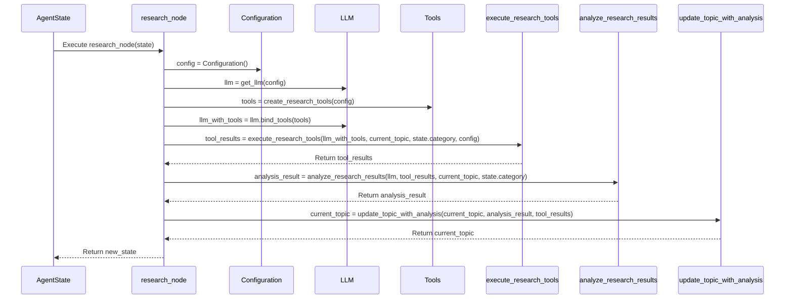

# Graph Engine Module

## Overview

The Graph Engine module (`src/agent/graph.py`) is the core orchestration system of the agent platform. Built on LangGraph, it defines, manages, and executes the workflow that coordinates the agent's activities through a directed graph of processing nodes.

## Primary Responsibilities

1. **Workflow Definition**: Creating the directed graph structure with nodes and edges
2. **Node Implementation**: Providing the business logic for each processing step
3. **State Flow Control**: Managing the transitions between nodes based on decision logic
4. **Error Handling**: Detecting and responding to failures during execution
5. **Graph Execution**: Invoking the graph with input data and processing the output

## Core Components

### Graph Construction

The core function for creating the base state graph:

```python
def create_base_graph(config: Configuration) -> StateGraph:
    """Create the base state graph with all nodes and edges defined.
    
    This function constructs a LangGraph StateGraph with all processing
    nodes and the edges that define the flow between them.
    
    Args:
        config: The configuration object with settings
        
    Returns:
        StateGraph: The fully constructed graph
    """
    # Create a new state graph with AgentState as the state type
    graph = StateGraph(AgentState)
    
    # Add nodes to the graph
    graph.add_node("main", main_node)
    graph.add_node("research", research_node)
    graph.add_node("market", market_node)
    graph.add_node("reflection", reflection_node)
    graph.add_node("finalization", finalization_node)
    graph.add_node("error_handler", error_handler_node)
    
    # Define the edges between nodes
    graph.add_edge("main", "research")
    graph.add_conditional_edges(
        "research",
        research_complete,
        {
            "research": "research",
            "market": "market"
        }
    )
    graph.add_edge("market", "reflection")
    graph.add_conditional_edges(
        "reflection",
        should_continue,
        {
            "research": "research",
            "finalization": "finalization",
            "error_handler": "error_handler"
        }
    )
    
    # Set the entry point
    graph.set_entry_point("main")
    
    return graph
```

### Runnable Graph Creation

The function that creates a complete runnable agent:

```python
def create_graph(config: Configuration) -> AgentRunnable:
    """Create a complete runnable agent graph.
    
    This function builds a complete agent graph and wraps it in a Runnable
    interface for easy invocation.
    
    Args:
        config: The configuration object with settings
        
    Returns:
        AgentRunnable: The runnable agent graph
    """
    # Create the base graph
    graph = create_base_graph(config)
    
    # Compile the graph to create a runnable
    runnable = graph.compile()
    
    # Wrap in the AgentRunnable class for additional functionality
    return AgentRunnable(config, runnable)
```

### Graph Execution

The function for invoking the graph:

```python
async def invoke_graph(data: Dict[str, Any]) -> Dict[str, Any]:
    """Execute the agent graph with the provided input data.
    
    This function prepares the input data, invokes the graph, and processes
    the output.
    
    Args:
        data: Input data for the graph execution
        
    Returns:
        Dict[str, Any]: The execution results
    """
    # Initialize configuration
    config = Configuration()
    
    # Create the graph if not already initialized
    if not hasattr(invoke_graph, "graph"):
        invoke_graph.graph = create_graph(config)
    
    # Sanitize and prepare input data
    sanitized_data = _sanitize_input_data(data)
    
    # Create the agent state from the input data
    agent_state = _prepare_agent_state(sanitized_data)
    
    # Execute the graph with the prepared state
    try:
        result = await invoke_graph.graph.ainvoke(agent_state)
        return {"success": True, "result": serialize_agent_state(result)}
    except Exception as e:
        logger.exception(f"Error invoking graph: {str(e)}")
        return {
            "success": False,
            "error": str(e),
            "error_type": type(e).__name__
        }
```

### Node Functions

The primary processing functions that implement the node logic:

#### Main Node

```python
@handle_agent_errors
async def main_node(state: AgentState) -> AgentState:
    """Entry point for the agent workflow.
    
    This node initializes the agent process, handles initial topic processing,
    and prepares the state for subsequent operations.
    
    Args:
        state: The current agent state
        
    Returns:
        AgentState: The updated agent state
    """
    # Ensure valid state
    if state is None:
        state = _create_default_state()
        
    # Create a new state to avoid modifying the input
    new_state = create_new_agent_state(state)
    
    # Initialize configuration
    config = Configuration()
    
    # Initialize LLM
    llm = get_llm(config)
    
    # Process initial topic if needed
    if not new_state.topics:
        # Extract topic from input if available
        topic = _extract_initial_topic(new_state)
        
        if topic:
            new_state.topics.append({
                "name": topic["name"],
                "description": topic["description"],
                "status": "pending",
                "priority": 1,
                "created_at": datetime.now().isoformat()
            })
            
    # Update metadata
    new_state.metadata["current_node"] = "main"
    new_state.metadata["updated_at"] = datetime.now().isoformat()
    
    return new_state
```

#### Research Node

```python
@handle_agent_errors
async def research_node(state: AgentState) -> AgentState:
    """Perform research operations on the current topic.
    
    This node executes research tools to gather information on the current
    topic, analyzes the results, and updates the state with the findings.
    
    Args:
        state: The current agent state
        
    Returns:
        AgentState: The updated agent state
    """
    # Ensure valid state
    if state is None:
        state = _create_default_state()
        
    # Create a new state to avoid modifying the input
    new_state = create_new_agent_state(state)
    
    # Get the current topic for research
    current_topic = _get_current_research_topic(new_state)
    
    # If no topic is available for research, mark research as complete and advance
    if not current_topic:
        new_state.research_state["completed"] = True
        new_state.metadata["current_node"] = "research"
        new_state.metadata["updated_at"] = datetime.now().isoformat()
        return new_state
        
    # Update topic status
    current_topic["status"] = "in_progress"
    
    # Initialize configuration and tools
    config = Configuration()
    llm = get_llm(config)
    tools = create_research_tools(config)
    llm_with_tools = llm.bind_tools(tools)
    
    # Execute research tools
    tool_results = await execute_research_tools(
        llm_with_tools,
        current_topic,
        new_state.category,
        config
    )
    
    # Analyze the research results
    analysis_result = await analyze_research_results(
        llm,
        tool_results,
        current_topic,
        new_state.category
    )
    
    # Update the topic with analysis
    current_topic = update_topic_with_analysis(
        current_topic,
        analysis_result,
        tool_results
    )
    
    # Update research state
    new_state.research_state["results"][current_topic["name"]] = {
        "tool_results": tool_results,
        "analysis": analysis_result
    }
    
    # Check if enough research has been done
    if _is_research_sufficient(current_topic, analysis_result):
        current_topic["status"] = "completed"
    else:
        # Increment research loop count
        new_state.research_state["loop_count"] = new_state.research_state.get("loop_count", 0) + 1
        
    # Update metadata
    new_state.metadata["current_node"] = "research"
    new_state.metadata["updated_at"] = datetime.now().isoformat()
    
    return new_state
```

### Edge Functions

Functions that determine the flow between nodes:

```python
def research_complete(state: AgentState) -> Literal["market", "research"]:
    """Determine if research is complete or if more research is needed.
    
    This edge function checks if all research is complete and decides
    whether to proceed to market analysis or continue research.
    
    Args:
        state: The current agent state
        
    Returns:
        Literal["market", "research"]: The next node to execute
    """
    # Check if research state is explicitly marked as complete
    if state.research_state.get("completed", False):
        return "market"
        
    # Check if all topics are researched
    all_topics_researched = all(
        topic["status"] == "completed" 
        for topic in state.topics
    )
    
    if all_topics_researched:
        return "market"
        
    # Check research loop count to prevent infinite loops
    loop_count = state.research_state.get("loop_count", 0)
    if loop_count >= MAX_RESEARCH_LOOPS:
        # Force completion if max loops reached
        return "market"
        
    # Continue research
    return "research"
```

### Error Handling

The error handler node and decorator for consistent error management:

```python
@handle_agent_errors
async def error_handler_node(state: AgentState) -> AgentState:
    """Handle errors that occur during workflow execution.
    
    This node attempts to recover from errors or provides a graceful
    failure if recovery is not possible.
    
    Args:
        state: The current agent state
        
    Returns:
        AgentState: The updated agent state
    """
    # Ensure valid state
    if state is None:
        state = _create_default_state()
        
    # Create a new state to avoid modifying the input
    new_state = create_new_agent_state(state)
    
    # Get the most recent error
    latest_error = None
    if new_state.errors and len(new_state.errors) > 0:
        latest_error = new_state.errors[-1]
        
    # Attempt recovery based on error type
    if latest_error:
        # Update error status
        latest_error["recovery_attempts"] = latest_error.get("recovery_attempts", 0) + 1
        
        # Implement recovery logic based on error type or node
        if latest_error["node"] == "research":
            # Recovery for research failures
            new_state = _recover_research_error(new_state, latest_error)
        elif latest_error["node"] == "market":
            # Recovery for market failures
            new_state = _recover_market_error(new_state, latest_error)
        else:
            # Generic recovery
            new_state = _perform_generic_recovery(new_state, latest_error)
            
    # Update metadata
    new_state.metadata["current_node"] = "error_handler"
    new_state.metadata["updated_at"] = datetime.now().isoformat()
    
    return new_state
```

```python
def handle_agent_errors(func):
    """Decorator for handling errors in agent node functions.
    
    This decorator catches exceptions, logs them, and adds them to the
    state's error list for tracking and recovery.
    
    Args:
        func: The node function to wrap
        
    Returns:
        The wrapped function with error handling
    """
    @functools.wraps(func)
    async def wrapper(state: AgentState, *args, **kwargs) -> AgentState:
        try:
            return await func(state, *args, **kwargs)
        except Exception as e:
            # Log the error
            logger.exception(f"Error in {func.__name__}: {str(e)}")
            
            # Ensure we have a valid state to return
            if state is None:
                state = _create_default_state()
                
            # Create a new state to avoid modifying the input
            new_state = create_new_agent_state(state)
            
            # Add error to the state
            error_details = {
                "timestamp": datetime.now().isoformat(),
                "node": func.__name__.replace("_node", ""),
                "message": str(e),
                "error_type": type(e).__name__,
                "details": {
                    "traceback": traceback.format_exc()
                },
                "recovery_attempts": 0,
                "resolved": False
            }
            
            new_state.errors.append(error_details)
            
            # Update metadata
            new_state.metadata["has_errors"] = True
            new_state.metadata["updated_at"] = datetime.now().isoformat()
            
            return new_state
    return wrapper
```

## Graph Structure

The agent graph is structured as a directed graph with the following components:

### Nodes

| Node Name | Function | Description |
|-----------|----------|-------------|
| `main` | `main_node` | Entry point for the workflow |
| `research` | `research_node` | Performs research operations |
| `market` | `market_node` | Analyzes market data |
| `reflection` | `reflection_node` | Evaluates quality and completeness |
| `finalization` | `finalization_node` | Generates final outputs |
| `error_handler` | `error_handler_node` | Handles and recovers from errors |

### Edges

| From | To | Condition | Description |
|------|------|-----------|-------------|
| `main` | `research` | (always) | Start with research after initialization |
| `research` | `research` | `research_complete` returns "research" | Continue research if not complete |
| `research` | `market` | `research_complete` returns "market" | Move to market analysis when research is done |
| `market` | `reflection` | (always) | Validate results after market analysis |
| `reflection` | `research` | `should_continue` returns "research" | Return to research if validation fails |
| `reflection` | `finalization` | `should_continue` returns "finalization" | Proceed to finalization if validation passes |
| `reflection` | `error_handler` | `should_continue` returns "error_handler" | Handle errors if validation reveals problems |

## AgentRunnable Class

The wrapper class that provides a standard interface for invoking the graph:

```python
class AgentRunnable(Runnable):
    """Runnable wrapper for the agent graph.
    
    This class wraps the compiled LangGraph StateGraph to provide a standard
    Runnable interface with additional functionality.
    
    Attributes:
        config: The configuration object with settings
        graph: The compiled state graph
    """
    
    def __init__(self, config: Configuration, graph: Optional[Runnable] = None):
        """Initialize the runnable agent.
        
        Args:
            config: The configuration object with settings
            graph: Optional pre-compiled graph (will create new if None)
        """
        self.config = config
        self.graph = graph or create_base_graph(config).compile()
        
    def invoke(
        self,
        input: Any,
        config: Optional[RunnableConfig] = None,
        **kwargs: Any
    ) -> Any:
        """Synchronously invoke the agent graph.
        
        Args:
            input: Input data or state
            config: Optional runtime configuration
            **kwargs: Additional keyword arguments
            
        Returns:
            The execution result
        """
        # Ensure input is a valid state
        if not isinstance(input, AgentState):
            # Convert input to agent state
            input = _prepare_agent_state(input)
            
        # Invoke the graph
        return self.graph.invoke(input, config, **kwargs)
        
    async def ainvoke(
        self,
        input: Any,
        config: Optional[RunnableConfig] = None,
        **kwargs: Any
    ) -> Any:
        """Asynchronously invoke the agent graph.
        
        Args:
            input: Input data or state
            config: Optional runtime configuration
            **kwargs: Additional keyword arguments
            
        Returns:
            The execution result
        """
        # Ensure input is a valid state
        if not isinstance(input, AgentState):
            # Convert input to agent state
            input = _prepare_agent_state(input)
            
        # Invoke the graph asynchronously
        return await self.graph.ainvoke(input, config, **kwargs)
```

## Workflow Diagram - Research Node Execution

The research node is a key component of the workflow, as illustrated in this sequence diagram:



## Usage Examples

### Creating and Initializing the Graph

```python
from agent.configuration import Configuration
from agent.graph import create_graph, initialize_graph

# Initialize configuration
config = Configuration()

# Create a graph with initialization
initialize_graph(config)

# Create a specific graph instance
graph = create_graph(config)
```

### Invoking the Graph

```python
from agent.graph import invoke_graph

async def process_request(data):
    """Process a request through the agent graph."""
    # Prepare input data
    input_data = {
        "category": "market_research",
        "topic": "renewable energy technologies",
        "depth": "comprehensive"
    }
    
    # Invoke the graph
    result = await invoke_graph(input_data)
    
    # Process the result
    if result["success"]:
        return result["result"]
    else:
        # Handle error
        logger.error(f"Graph execution failed: {result['error']}")
        return {"error": result["error"]}
```

### Adding a Custom Node

```python
from agent.graph import StateGraph, AgentState, handle_agent_errors

@handle_agent_errors
async def custom_processing_node(state: AgentState) -> AgentState:
    """Custom node to perform specialized processing."""
    # Ensure valid state
    if state is None:
        state = _create_default_state()
        
    # Create a new state to avoid modifying the input
    new_state = create_new_agent_state(state)
    
    # Perform custom processing
    # ...
    
    # Update metadata
    new_state.metadata["current_node"] = "custom_processing"
    new_state.metadata["updated_at"] = datetime.now().isoformat()
    
    return new_state

def extend_graph(graph: StateGraph) -> StateGraph:
    """Extend the standard graph with custom nodes."""
    # Add the custom node
    graph.add_node("custom_processing", custom_processing_node)
    
    # Add edge from an existing node
    graph.add_conditional_edges(
        "reflection",
        lambda state: "custom_processing" if state.metadata.get("needs_custom_processing") else "finalization",
        {
            "custom_processing": "custom_processing",
            "finalization": "finalization"
        }
    )
    
    # Add edge from custom node back to standard flow
    graph.add_edge("custom_processing", "finalization")
    
    return graph
```

## Best Practices

1. **State Immutability**: Always create new state objects rather than modifying input states
2. **Error Handling**: Use the `handle_agent_errors` decorator for all node functions
3. **State Validation**: Validate state at the beginning of each node function
4. **Clean Edge Logic**: Keep edge functions simple and focused on a single decision
5. **Module Separation**: Maintain separation between graph, state, and business logic
6. **Metadata Updates**: Update state metadata in every node for traceability
7. **Limited Node Scope**: Keep each node focused on a specific task
8. **Graceful Degradation**: Design for resilience when components fail
9. **Testing**: Create comprehensive tests for nodes, edges, and full graph execution

## Related Components

- **State Management**: Provides the data structures used throughout the graph
- **Configuration Module**: Supplies settings used to configure graph behavior
- **Agent Tools**: Executed by nodes to perform external operations
- **Utility Functions**: Support common operations needed by node functions 