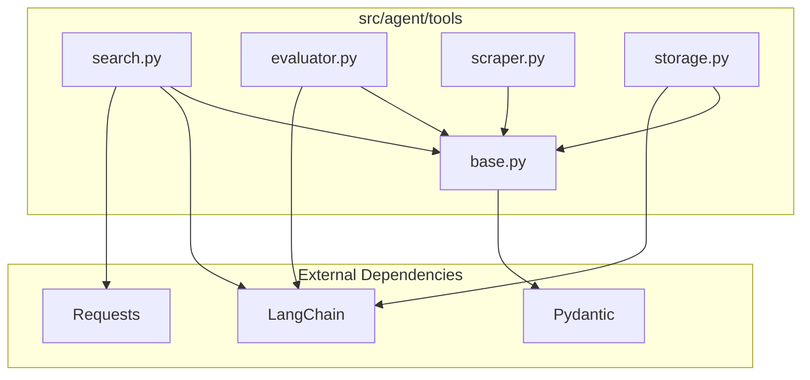
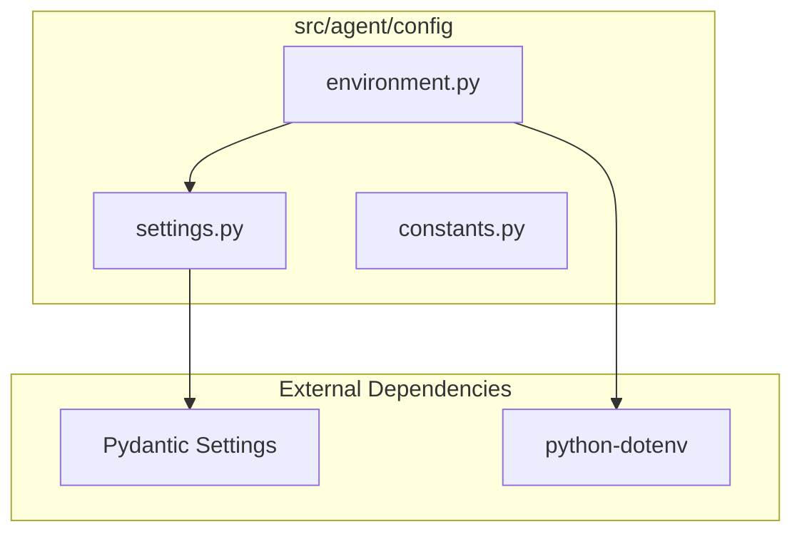

# Module Dependencies

This document provides a comprehensive visualization of the dependencies between various modules in the Agent System. Understanding these dependencies is essential for maintaining and extending the system.

## Core Package Dependencies

```mermaid
graph TD
    subgraph core["src/agent/core"]
        agent["agent.py"] --> state["state.py"]
        graph["graph.py"] --> state
        state --> interface["interface.py"]
    end

    subgraph external["External Dependencies"]
        pydantic["Pydantic"]
        langgraph["LangGraph"]
        typing["Python typing"]
    end

    state --> pydantic
    graph --> langgraph
    agent --> typing
    interface --> typing
```

The Core package provides fundamental components that are used throughout the Agent System:

- **graph.py**: Implements the execution graph mechanism using LangGraph patterns
- **state.py**: Manages state creation, validation, and transformation
- **agent.py**: Defines the agent interfaces and implementations
- **interface.py**: Provides common interfaces for the entire system

## Node Package Dependencies

```mermaid
graph TD
    subgraph nodes["src/agent/nodes"]
        main["main.py"] --> validation["validation.py"]
        main --> error["error.py"]
        research["research.py"] --> validation
        market["market.py"] --> validation
        analysis["analysis.py"] --> validation
        quality_evaluation["quality_evaluation.py"] --> validation
        error --> validation
    end

    subgraph core["src/agent/core"]
        state["state.py"]
        graph["graph.py"]
    end

    subgraph tools["src/agent/tools"]
        base["base.py"]
        search["search.py"]
        evaluator["evaluator.py"]
    end

    main --> graph
    main --> state
    research --> search
    research --> state
    market --> state
    analysis --> state
    quality_evaluation --> evaluator
    quality_evaluation --> state
    error --> state
```

The Nodes package provides the processing logic for different stages of the agent workflow:

- **main.py**: Entry point for agent workflow, directs flow to appropriate nodes
- **research.py**: Handles research operations using search tools
- **market.py**: Performs market analysis on research data
- **analysis.py**: Conducts data analysis and generates insights
- **quality_evaluation.py**: Evaluates the quality of generated content
- **validation.py**: Provides validation utilities for all nodes
- **error.py**: Handles error detection and recovery

## Tool Package Dependencies



The Tools package provides utilities for performing specific operations:

- **base.py**: Defines the base tool interface and tool registry
- **search.py**: Implements search functionality for gathering information
- **evaluator.py**: Provides evaluation capabilities for assessing content quality
- **scraper.py**: Implements web scraping functionality
- **storage.py**: Provides data persistence capabilities

## Config Package Dependencies



The Config package manages configuration and environment settings:

- **settings.py**: Defines configuration settings using Pydantic
- **environment.py**: Manages environment-specific configuration
- **constants.py**: Defines system constants

## Supervisors Package Dependencies

```mermaid
graph TD
    subgraph supervisors["src/agent/supervisors"]
        coordinator["coordinator.py"]
        monitor["monitor.py"]
    end

    subgraph core["src/agent/core"]
        graph["graph.py"]
        state["state.py"]
    end

    subgraph nodes["src/agent/nodes"]
        main["main.py"]
        error["error.py"]
    end

    coordinator --> graph
    coordinator --> state
    coordinator --> main
    monitor --> state
    monitor --> error
```

The Supervisors package provides components for orchestrating and monitoring agent execution:

- **coordinator.py**: Coordinates the execution of multiple agent workflows
- **monitor.py**: Monitors agent execution and handles failures

## Cross-Package Dependencies

```mermaid
graph TD
    subgraph app["Application"]
        app["Application Code"]
    end

    subgraph core["Core"]
        graph["Graph Engine"]
        state["State Management"]
        agent["Agent Interface"]
    end

    subgraph nodes["Nodes"]
        main["Main Node"]
        research["Research Node"]
        market["Market Node"]
        analysis["Analysis Node"]
        error["Error Node"]
        validation["Validation Node"]
    end

    subgraph tools["Tools"]
        base["Base Tool"]
        search["Search Tools"]
        evaluator["Evaluator Tools"]
    end

    subgraph config["Config"]
        settings["Settings"]
    end

    subgraph supervisors["Supervisors"]
        coordinator["Coordinator"]
        monitor["Monitor"]
    end

    app --> core
    app --> config
    app --> supervisors

    core --> nodes
    core --> tools

    nodes --> tools
    nodes --> core

    supervisors --> core
    supervisors --> nodes

    tools --> config
    nodes --> config
```

This high-level view shows the dependencies between major packages in the system. The key insights from this diagram are:

1. The Core package is central to the system, with most other packages depending on it
2. Nodes package integrates with Tools for specific functionality
3. All packages rely on Config for settings
4. Supervisors package orchestrates the execution of Core and Nodes components

## Dependency Management Considerations

When maintaining or extending the Agent System, consider the following:

1. **Circular Dependencies**: Avoid creating circular dependencies between modules
2. **Dependency Direction**: Dependencies should flow from higher-level modules to lower-level modules
3. **Interface Separation**: Use interfaces to decouple modules
4. **Configuration Isolation**: Keep configuration separate from business logic

By understanding and respecting these dependency patterns, developers can maintain the modularity and extensibility of the Agent System. 