# System Flows Documentation

[code:agent/tools/search/providers/jina.py]

[code:agent/tools/search/providers/searxng.py]

[code:agent/tools/search/providers/brave.py]

[code:agent/tools/search/providers/__init__.py]

[code:agent/tools/search/providers/composite.py]

[code:agent/tools/search/factory.py]

[code:agent/tools/search/base.py]

[code:agent/tools/search/__init__.py]

[code:agent/tools/generators/base_generator.py]

[code:agent/tools/generators/txt_generator.py]

[code:agent/tools/generators/json_generator.py]

[code:agent/tools/generators/__init__.py]

[code:agent/tools/generators/generator_factory.py]

[code:agent/tools/extractors/csv_extractor.py]

[code:agent/tools/extractors/base_extractor.py]

[code:agent/tools/extractors/pdf_extractor.py]

[code:agent/tools/extractors/__init__.py]

[code:agent/tools/extractors/extractor_factory.py]

[code:agent/services/qdrant.py]

[code:agent/services/postgres.py]

[code:agent/services/__init__.py]

[code:agent/reflection/critique.py]

[code:agent/reflection/feedback.py]

[code:agent/reflection/evaluator.py]

[code:agent/reflection/__init__.py]

[code:agent/checkpoints/persistence.py]

[code:agent/checkpoints/recovery.py]

[code:agent/checkpoints/versioning.py]

[code:agent/checkpoints/__init__.py]

[code:agent/utils/logging.py]

[code:agent/utils/error_handling.py]

[code:agent/utils/cache.py]

[code:agent/utils/proxy.py]

[code:agent/utils/http.py]

[code:agent/utils/langgraph_adapter.py]

[code:agent/utils/extraction.py]

[code:agent/utils/async_utils.py]

[code:agent/utils/retry_stats.py]

[code:agent/utils/company_extraction.py]

[code:agent/utils/__init__.py]

[code:agent/prompts/validation.py]

[code:agent/prompts/templates.py]

[code:agent/prompts/research.py]

[code:agent/prompts/reflection.py]

[code:agent/prompts/__init__.py]

[code:agent/prompts/analysis.py]

[code:agent/tools/document_processor.py]

[code:agent/tools/code_executor.py]

[code:agent/tools/base.py]

[code:agent/tools/vizualization.py]

[code:agent/tools/human_feedback.py]

[code:agent/tools/scraper.py]

[code:agent/tools/storage.py]

[code:agent/tools/evaluator.py]

[code:agent/tools/__init__.py]

[code:agent/tools/mock_tools.py]

[code:agent/core/state.py]

[code:agent/core/graph.py]

[code:agent/core/agent.py]

[code:agent/core/__init__.py]

[code:agent/cli/visualize.py]

[code:agent/cli/__init__.py]

[code:agent/cli/run.py]

[code:agent/subgraphs/analysis_flow.py]

[code:agent/subgraphs/validation_flow.py]

[code:agent/subgraphs/research_flow.py]

[code:agent/subgraphs/__init__.py]

[code:agent/supervisors/team_supervisor.py]

[code:agent/supervisors/orchestrator.py]

[code:agent/supervisors/__init__.py]

[code:agent/supervisors/task_manager.py]

[code:agent/nodes/market.py]

[code:agent/nodes/validation.py]

[code:agent/nodes/research.py]

[code:agent/nodes/__init__.py]

[code:agent/nodes/analysis.py]

[code:agent/nodes/error.py]

[code:agent/nodes/main.py]

[code:agent/config/settings.py]

[code:agent/config/types.py]

[code:agent/config/__init__.py]

[code:agent/config/configuration.py]

[code:agent/examples/simple_graph.py]

[code:agent/examples/__init__.py]

[code:agent/constants.py]

[code:agent/log_config.py]

[code:agent/exceptions.py]

[code:agent/__init__.py]

This document provides comprehensive flow diagrams for the Agent System, showing both module-level internal flows and inter-module interactions.

## Table of Contents

1. [Module-Level Flows](#module-level-flows)
   - [Configuration Module](#configuration-module-flow)
   - [State Management Module](#state-management-module-flow)
   - [Graph Engine Module](#graph-engine-module-flow)
   - [Agent Tools Module](#agent-tools-module-flow)
   - [Prompt Management Module](#prompt-management-module-flow)
   - [Logging System Module](#logging-system-module-flow)
   - [Utility Functions Module](#utility-functions-module-flow)
2. [Inter-Module Flows](#inter-module-flows)
   - [Complete Agent Workflow](#complete-agent-workflow)
   - [Research Process Flow](#research-process-flow)
   - [Market Analysis Flow](#market-analysis-flow)
   - [Error Handling Flow](#error-handling-flow)
   - [Web Search and Analysis Flow](#web-search-and-analysis-flow)
   - [Tool Execution Flow](#tool-execution-flow)

## Module-Level Flows

This section shows the internal flows within each module, illustrating how components within a module interact.

### Configuration Module Flow

The initialization and usage flow of the Configuration module:

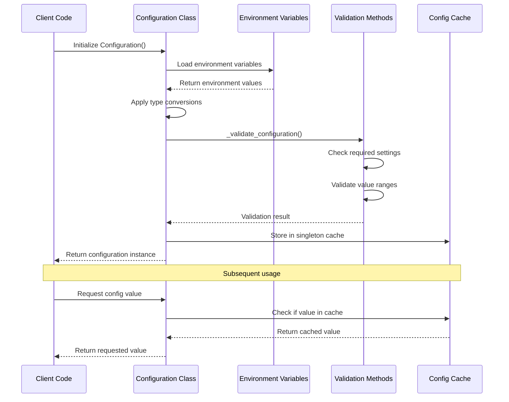

### State Management Module Flow

The flow of state creation, validation, and transformation:

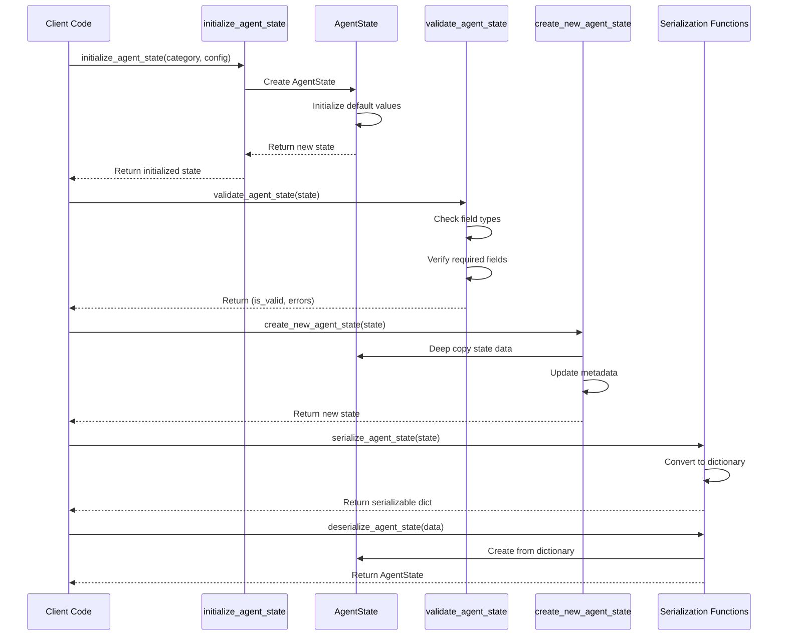

### Graph Engine Module Flow

The flow of graph creation and execution:

```mermaid
sequenceDiagram
    participant Client as Client Code
    participant Create as create_graph
    participant BaseGraph as create_base_graph
    participant StateGraph as StateGraph
    participant Nodes as Node Functions
    participant Edges as Edge Functions
    participant Run as invoke_graph
    participant Handler as Error Handler

    Client->>Create: create_graph(config)
    Create->>BaseGraph: create_base_graph(config)
    BaseGraph->>StateGraph: Initialize StateGraph()
    BaseGraph->>StateGraph: Add main_node
    BaseGraph->>StateGraph: Add research_node
    BaseGraph->>StateGraph: Add market_node
    BaseGraph->>StateGraph: Add reflection_node
    BaseGraph->>StateGraph: Add finalization_node
    BaseGraph->>StateGraph: Add error_handler_node
    BaseGraph->>Edges: Define conditional edges
    BaseGraph-->>Create: Return base graph
    Create->>Create: Add additional configuration
    Create-->>Client: Return AgentRunnable
    
    Client->>Run: invoke_graph(input_data)
    Run->>StateGraph: Start graph execution
    StateGraph->>Nodes: Execute main_node
    Nodes-->>StateGraph: Return updated state
    
    alt Based on edge conditions
        StateGraph->>Nodes: Execute research_node
        Nodes-->>StateGraph: Return updated state
    else Error occurs
        Nodes->>Handler: Handle error
        Handler-->>StateGraph: Return recovery state
    end
    
    StateGraph->>Nodes: Continue execution...
    Nodes-->>StateGraph: Final state
    StateGraph-->>Run: Completed state
    Run-->>Client: Return results
```

### Agent Tools Module Flow

The flow of tool registration, selection, and execution:

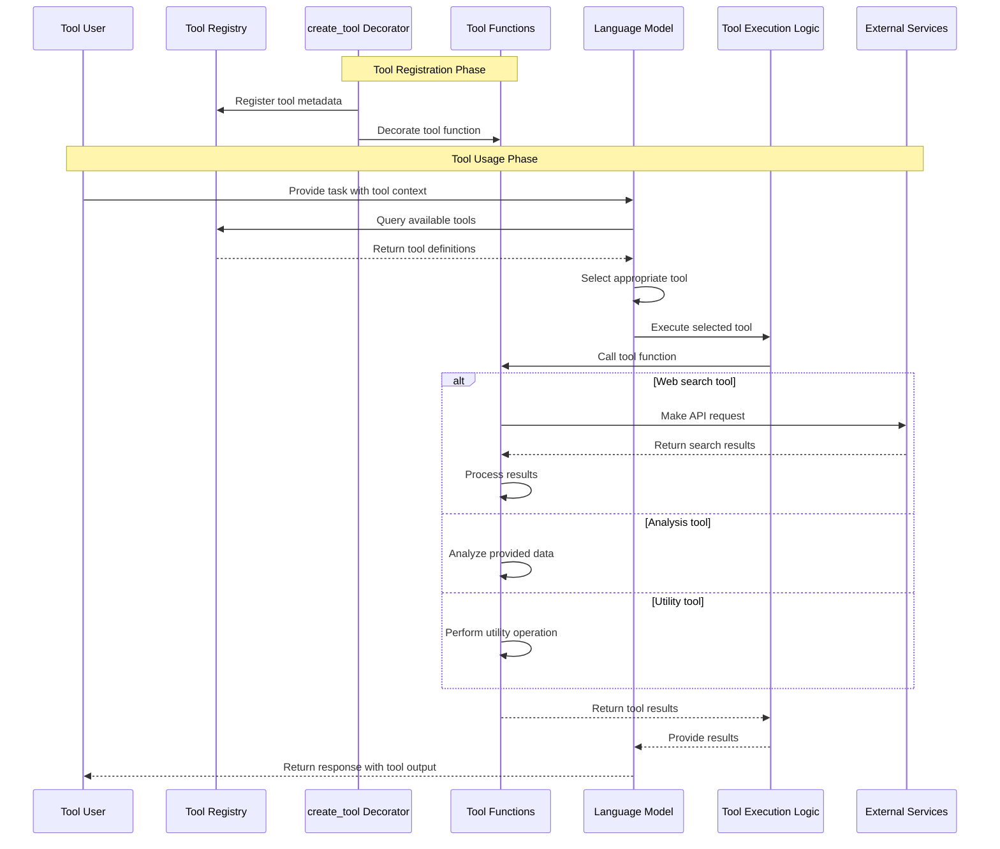

### Prompt Management Module Flow

The flow of prompt template creation and rendering:

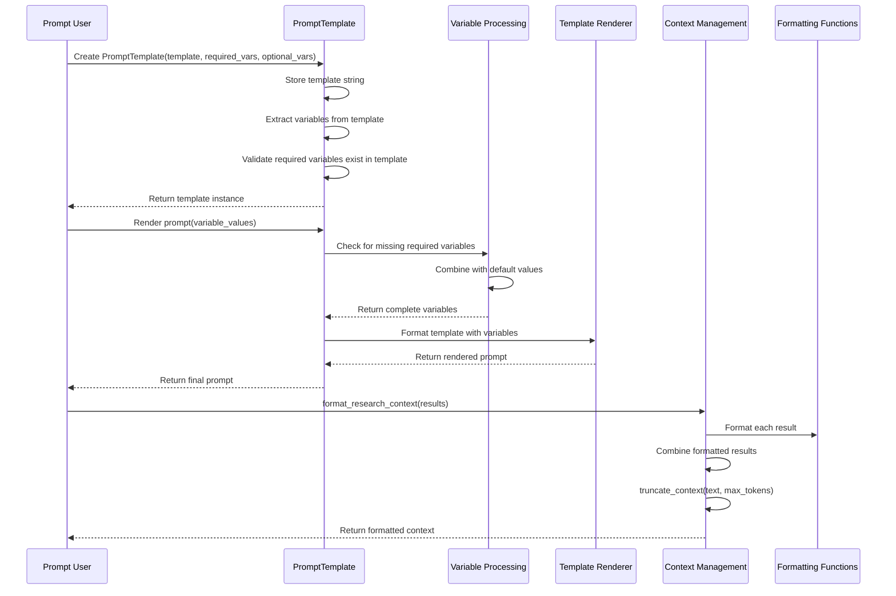

### Logging System Module Flow

The flow of logging system configuration and usage:

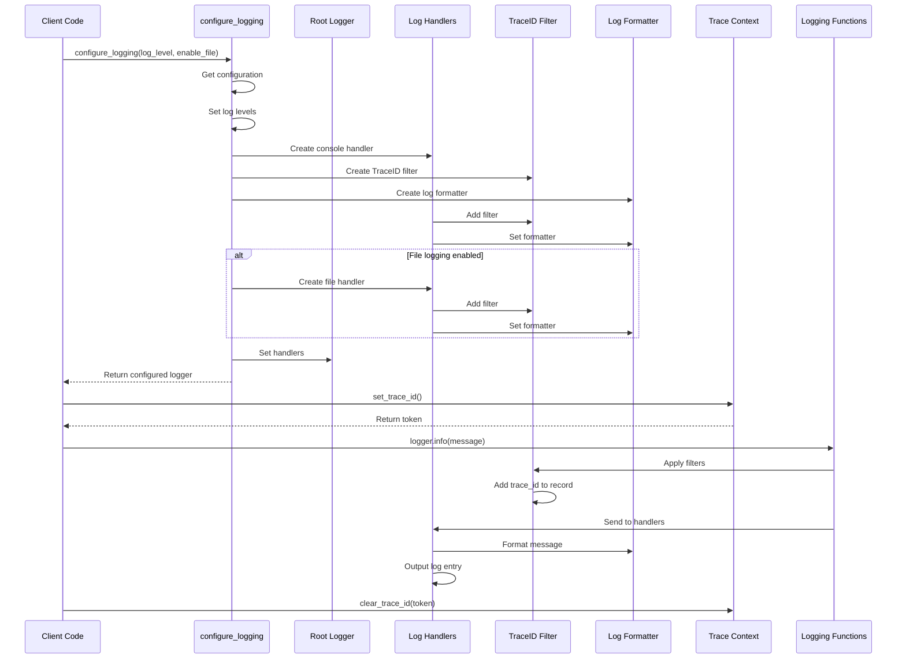

### Utility Functions Module Flow

The flow of key utility functions:

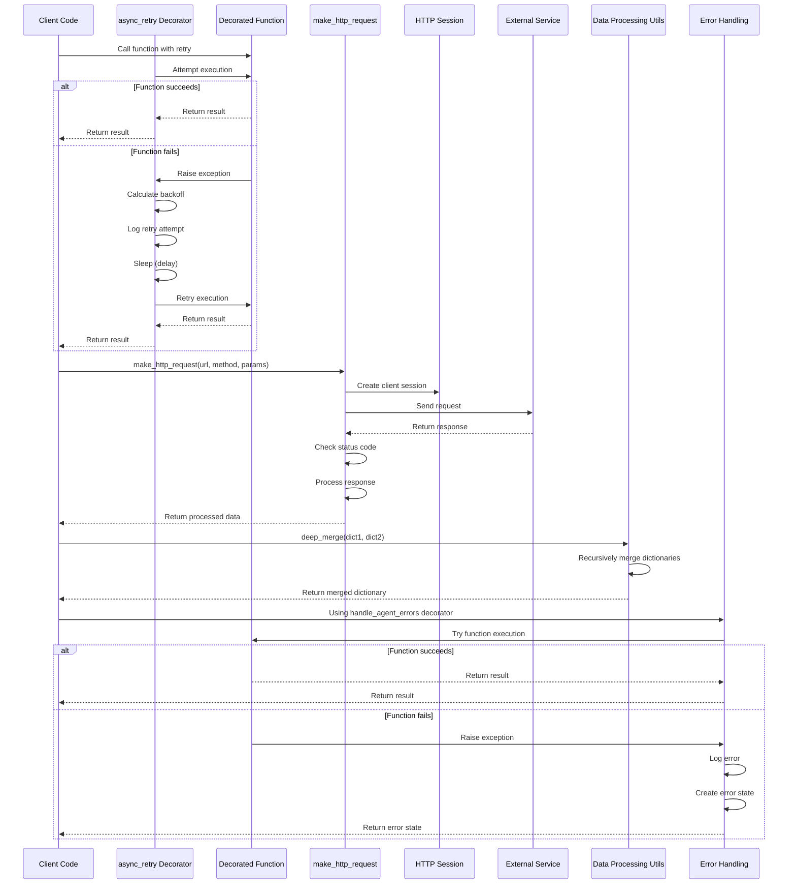

## Inter-Module Flows

This section illustrates how different modules interact with each other to accomplish system-level processes.

### Complete Agent Workflow

The end-to-end flow of a complete agent execution:

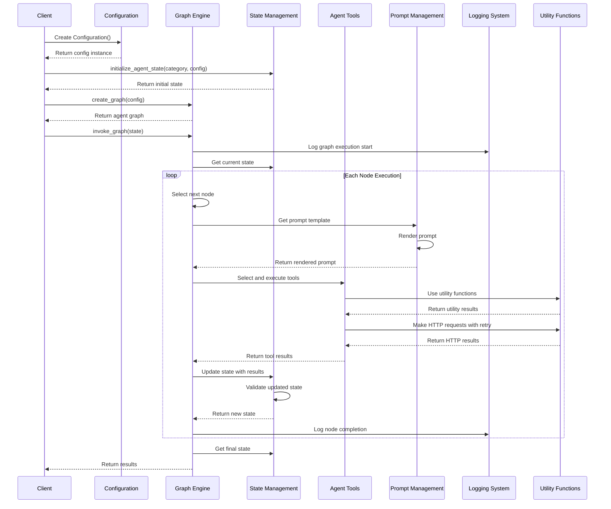

### Research Process Flow

The detailed flow of the research process across modules:

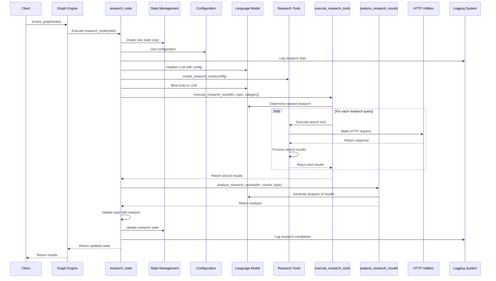

### Market Analysis Flow

The flow of the market analysis process across modules:

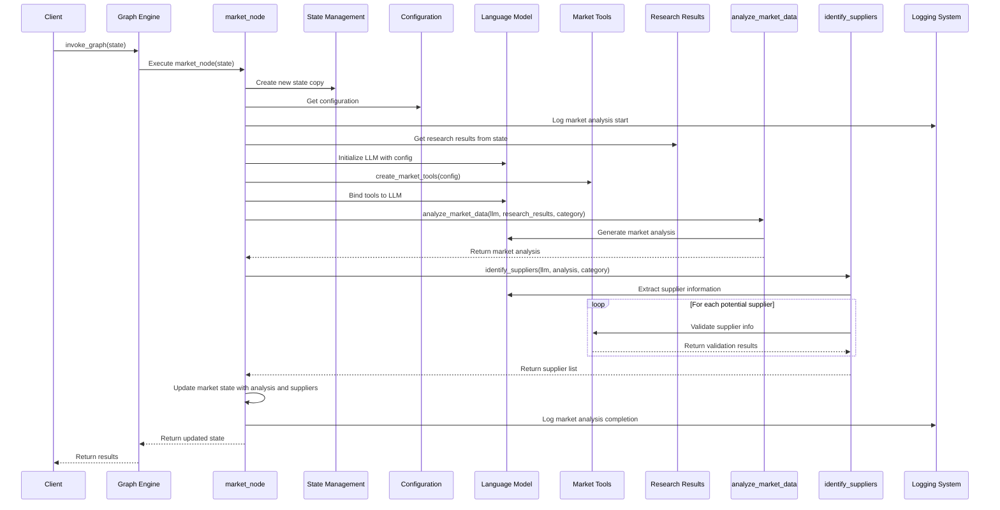

### Error Handling Flow

The cross-module flow of error detection, reporting, and recovery:

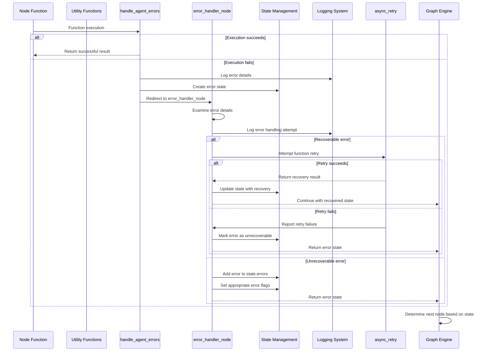

### Web Search and Analysis Flow

The detailed cross-module flow of web search and content analysis:

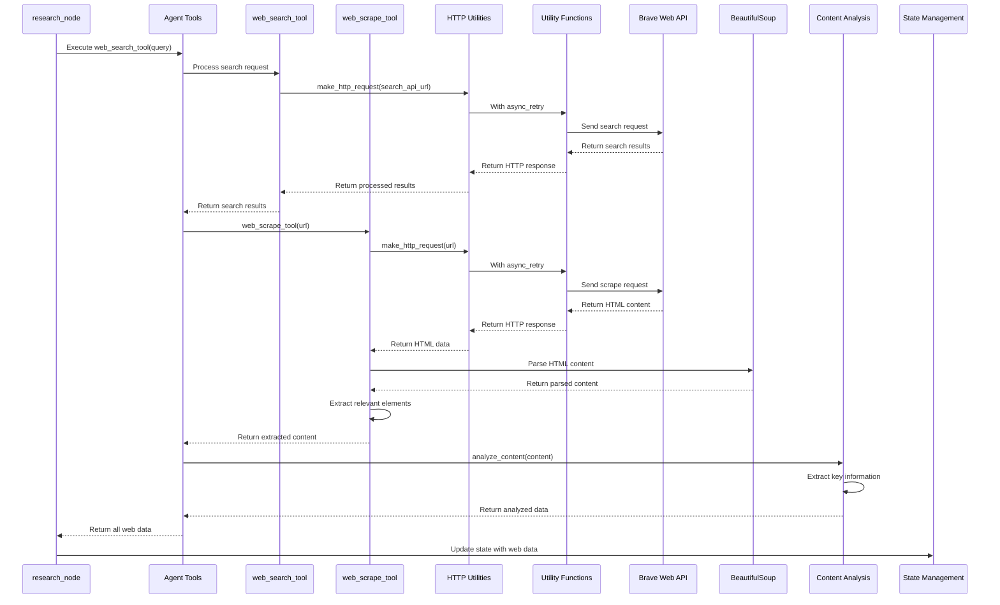

### Tool Execution Flow

The detailed flow of tool selection, execution, and result processing:

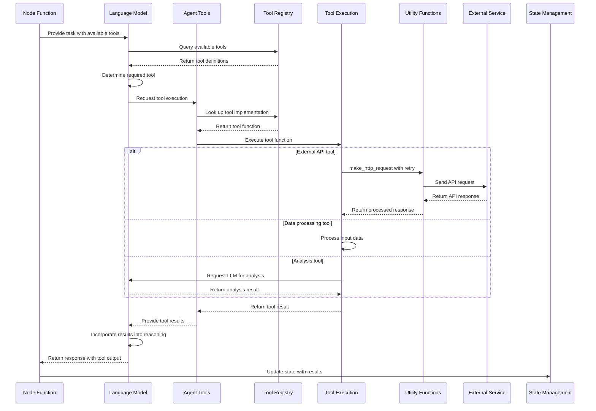