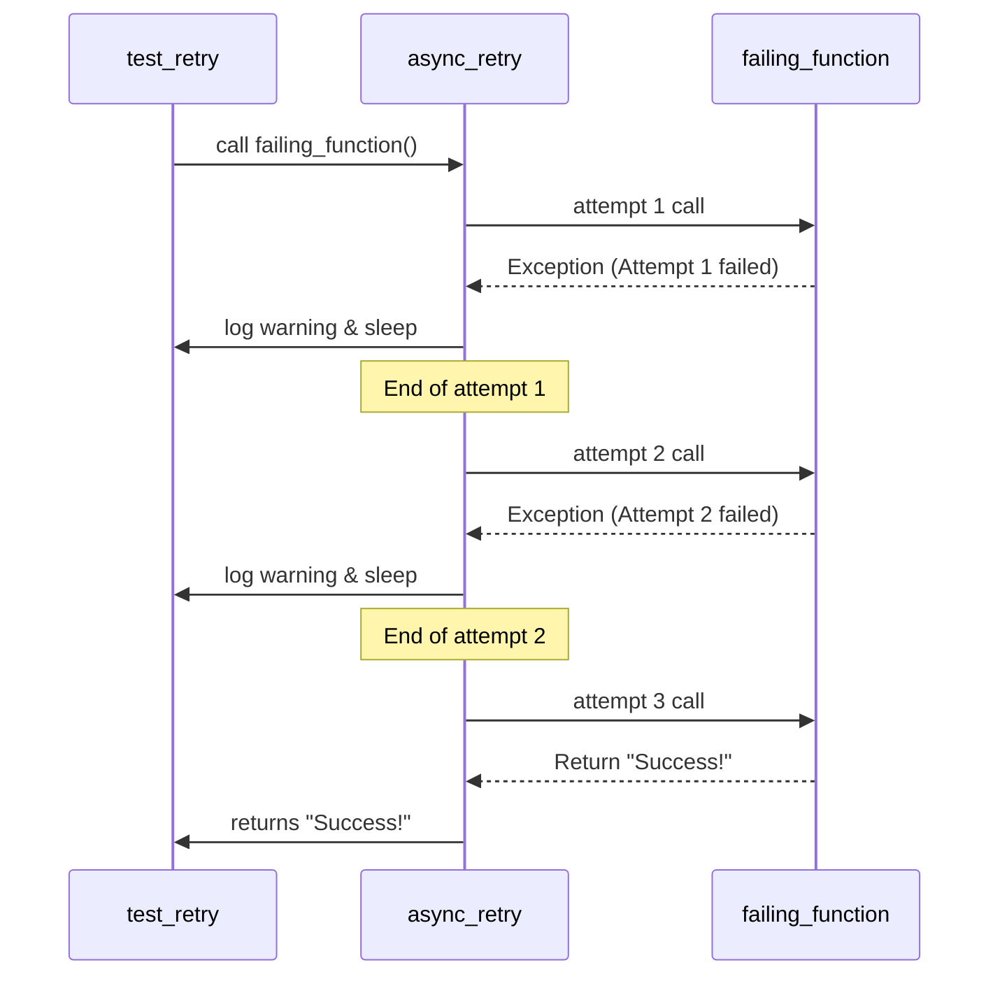
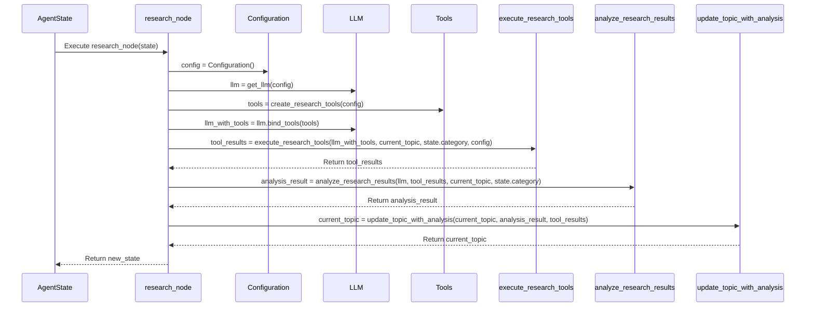
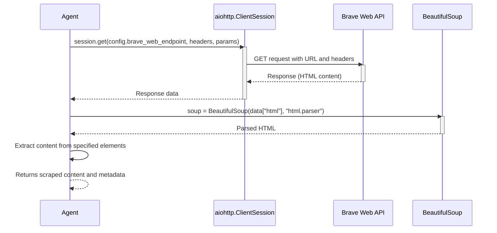

# Agent System Technical Manual

[code:agent/tools/search/providers/jina.py]

[code:agent/tools/search/providers/searxng.py]

[code:agent/tools/search/providers/brave.py]

[code:agent/tools/search/providers/__init__.py]

[code:agent/tools/search/providers/composite.py]

[code:agent/tools/search/factory.py]

[code:agent/tools/search/base.py]

[code:agent/tools/search/__init__.py]

[code:agent/tools/generators/base_generator.py]

[code:agent/tools/generators/txt_generator.py]

[code:agent/tools/generators/json_generator.py]

[code:agent/tools/generators/__init__.py]

[code:agent/tools/generators/generator_factory.py]

[code:agent/tools/extractors/csv_extractor.py]

[code:agent/tools/extractors/base_extractor.py]

[code:agent/tools/extractors/pdf_extractor.py]

[code:agent/tools/extractors/__init__.py]

[code:agent/tools/extractors/extractor_factory.py]

[code:agent/services/qdrant.py]

[code:agent/services/postgres.py]

[code:agent/services/__init__.py]

[code:agent/reflection/critique.py]

[code:agent/reflection/feedback.py]

[code:agent/reflection/evaluator.py]

[code:agent/reflection/__init__.py]

[code:agent/checkpoints/persistence.py]

[code:agent/checkpoints/recovery.py]

[code:agent/checkpoints/versioning.py]

[code:agent/checkpoints/__init__.py]

[code:agent/utils/logging.py]

[code:agent/utils/error_handling.py]

[code:agent/utils/cache.py]

[code:agent/utils/proxy.py]

[code:agent/utils/http.py]

[code:agent/utils/langgraph_adapter.py]

[code:agent/utils/extraction.py]

[code:agent/utils/async_utils.py]

[code:agent/utils/retry_stats.py]

[code:agent/utils/company_extraction.py]

[code:agent/utils/__init__.py]

[code:agent/prompts/validation.py]

[code:agent/prompts/templates.py]

[code:agent/prompts/research.py]

[code:agent/prompts/reflection.py]

[code:agent/prompts/__init__.py]

[code:agent/prompts/analysis.py]

[code:agent/tools/document_processor.py]

[code:agent/tools/code_executor.py]

[code:agent/tools/base.py]

[code:agent/tools/vizualization.py]

[code:agent/tools/human_feedback.py]

[code:agent/tools/scraper.py]

[code:agent/tools/storage.py]

[code:agent/tools/evaluator.py]

[code:agent/tools/__init__.py]

[code:agent/tools/mock_tools.py]

[code:agent/core/state.py]

[code:agent/core/graph.py]

[code:agent/core/agent.py]

[code:agent/core/__init__.py]

[code:agent/cli/visualize.py]

[code:agent/cli/__init__.py]

[code:agent/cli/run.py]

[code:agent/subgraphs/analysis_flow.py]

[code:agent/subgraphs/validation_flow.py]

[code:agent/subgraphs/research_flow.py]

[code:agent/subgraphs/__init__.py]

[code:agent/supervisors/team_supervisor.py]

[code:agent/supervisors/orchestrator.py]

[code:agent/supervisors/__init__.py]

[code:agent/supervisors/task_manager.py]

[code:agent/nodes/market.py]

[code:agent/nodes/validation.py]

[code:agent/nodes/research.py]

[code:agent/nodes/__init__.py]

[code:agent/nodes/analysis.py]

[code:agent/nodes/error.py]

[code:agent/nodes/main.py]

[code:agent/config/settings.py]

[code:agent/config/types.py]

[code:agent/config/__init__.py]

[code:agent/config/configuration.py]

[code:agent/examples/simple_graph.py]

[code:agent/examples/__init__.py]

[code:agent/constants.py]

[code:agent/log_config.py]

[code:agent/exceptions.py]

[code:agent/__init__.py]

## Table of Contents

1. [Introduction](#introduction)
2. [System Architecture](#system-architecture)
3. [Core Modules](#core-modules)
   - [Configuration Module](#configuration-module)
   - [State Management](#state-management)
   - [Graph Engine](#graph-engine)
   - [Agent Tools](#agent-tools)
   - [Utility Functions](#utility-functions)
   - [Prompt Management](#prompt-management)
   - [Logging System](#logging-system)
4. [Workflow Diagrams](#workflow-diagrams)
   - [Retry Mechanism](#retry-mechanism)
   - [Research Node Execution](#research-node-execution)
   - [Web Scraping Process](#web-scraping-process)
5. [API Reference](#api-reference)
6. [Error Handling](#error-handling)
7. [Best Practices](#best-practices)

## Introduction

This agent system is built on LangGraph and provides a framework for creating, managing, and executing AI agent workflows. The system is designed to handle various tasks including research, market analysis, and content generation through a state-based graph architecture.

The system uses a modular approach with distinct components handling specific responsibilities:
- State management for tracking the agent's progress
- Graph-based workflow control for orchestrating multi-step processes
- Tool integration for performing external actions
- LLM integration for intelligent decision making and content generation

## System Architecture

The agent system follows a directed graph architecture where nodes represent distinct processing steps and edges determine the flow between these steps. The architecture includes:

- **State Graph**: The core workflow engine based on LangGraph's StateGraph
- **Agent State**: The data model tracking all information about the agent's process
- **Node Functions**: Specialized processing units handling specific tasks
- **Edge Functions**: Control logic determining workflow progression

The system operates asynchronously, allowing for non-blocking operations and efficient resource utilization.

## Core Modules

### Configuration Module

**File: `src/agent/configuration.py`**

The Configuration module manages all system settings and parameters, providing a centralized location for controlling the agent's behavior. It handles environment variables, feature flags, and operational parameters.

#### Key Components:

- **Configuration Class**: Loads, validates, and provides access to all configuration settings
- **Environment Variable Management**: Securely accesses environment variables with appropriate defaults
- **Configuration Validation**: Ensures all required settings are properly configured
- **Feature Flag Management**: Controls enabling/disabling specific system features

### State Management

**File: `src/agent/state.py`**

The State Management module defines the data structures that track the agent's progress, knowledge, and decisions throughout its workflow. It provides mechanisms for initializing, updating, and validating state data.

#### Key Components:

- **AgentState Class**: The primary data model storing all agent state information
- **State Initialization**: Functions for creating properly structured initial states
- **State Validation**: Ensures state data conforms to expected schemas
- **State Transition Management**: Handles the progression of state through workflow steps

### Graph Engine

**File: `src/agent/graph.py`**

The Graph Engine is the core orchestration system that defines and executes the agent's workflow. Built on LangGraph, it manages the transitions between processing nodes based on the current state and decision logic.

#### Key Components:

- **StateGraph Construction**: Defines the workflow structure with nodes and edges
- **Node Functions**: Implements the business logic for each processing step
- **Edge Functions**: Determines the flow between nodes based on state evaluation
- **Error Handling**: Manages exceptions and provides recovery mechanisms
- **Graph Execution**: Controls the invocation and progression of the workflow

#### Key Functions:

##### `create_base_graph(config: Configuration) -> StateGraph`
Creates the foundational state graph with all nodes and edges defined.

##### `create_graph(config: Configuration) -> AgentRunnable`
Builds a complete runnable agent graph with all components initialized.

##### `invoke_graph(data: Dict[str, Any]) -> Dict[str, Any]`
Executes the graph with the provided input data and returns the results.

##### Main Processing Nodes:

###### `main_node(state: AgentState) -> AgentState`
The entry point node that handles initial topic processing and task delegation.

###### `research_node(state: AgentState) -> AgentState`
Performs research operations using various tools and processes the results.

###### `market_node(state: AgentState) -> AgentState`
Analyzes market data to identify suppliers and relevant items.

###### `reflection_node(state: AgentState) -> AgentState`
Evaluates the quality and completeness of the gathered information.

###### `finalization_node(state: AgentState) -> AgentState`
Generates final outputs and prepares the data for delivery.

###### `error_handler_node(state: AgentState) -> AgentState`
Handles exceptions and attempts to recover from error states.

### Agent Tools

**File: `src/agent/tools.py`**

The Tools module provides specialized functions that the agent can use to interact with external systems, gather information, and perform specific operations.

#### Key Components:

- **Tool Registration**: Mechanisms for defining and registering agent tools
- **Tool Execution**: Functions for invoking tools and processing their results
- **Tool Binding**: Integration with the LLM for tool selection and use

#### Common Tool Categories:

- **Research Tools**: Web search, document retrieval, and information gathering
- **Analysis Tools**: Data processing, summarization, and insight extraction
- **Validation Tools**: Fact-checking and verification operations
- **Output Generation Tools**: Content formatting and report creation

### Utility Functions

**File: `src/agent/utils.py`**

The Utilities module contains helper functions used throughout the agent system for common operations, data handling, and integration with external systems.

#### Key Components:

- **State Handling Utilities**: Functions for manipulating and validating state data
- **Error Handling Utilities**: Decorators and functions for consistent error management
- **Data Processing Utilities**: Helpers for transforming and processing various data formats
- **Integration Utilities**: Functions for interfacing with external APIs and services

### Prompt Management

**File: `src/agent/prompts.py`**

The Prompts module manages the text templates used for communicating with the LLM, ensuring consistent and effective language model interactions.

#### Key Components:

- **Prompt Templates**: Structured text templates for various agent operations
- **Prompt Rendering**: Functions for filling templates with contextual data
- **Prompt Management**: Organization and versioning of prompt content

### Logging System

**File: `src/agent/log_config.py`**

The Logging System provides structured logging capabilities throughout the agent system, facilitating debugging, monitoring, and performance analysis.

#### Key Components:

- **Logger Configuration**: Setup for consistent logging across all modules
- **Log Formatting**: Structured log formats for machine and human readability
- **Log Level Management**: Controls for the verbosity of system logging

## Workflow Diagrams

The following sequence diagrams illustrate key workflows within the agent system:

### Retry Mechanism

This diagram shows how the async_retry decorator handles transient failures by retrying operations with exponential backoff:

**Key Concepts:**
- The retry decorator catches exceptions from the wrapped function
- Each failure triggers a waiting period before retrying
- The process continues until either success or the maximum retry count is reached
- This mechanism improves system resilience to transient failures in external dependencies

### Research Node Execution

This diagram illustrates the execution flow of the research_node function, which is a key component in the agent's information gathering process:

**Key Concepts:**
- The research node initializes necessary components (configuration, LLM, tools)
- Research tools are executed to gather information on the current topic
- Results are analyzed to extract relevant insights
- The topic is updated with the new information
- A new state is returned to the graph for further processing

### Web Scraping Process

This diagram shows the web scraping process used to gather information from external sources:

**Key Concepts:**
- The agent uses aiohttp for asynchronous HTTP requests to the Brave Web API
- HTML responses are parsed using BeautifulSoup
- Specific elements are extracted based on the scraping requirements
- The process returns both the scraped content and metadata about the source

## API Reference

### State Management API

#### `initialize_agent_state(category: str, config: Dict[str, Any]) -> AgentState`
Creates a new agent state with the specified category and configuration.

#### `create_new_agent_state(state: AgentState) -> AgentState`
Creates a deep copy of the provided state to avoid modifying the original.

#### `sanitize_agent_state(state: AgentState) -> AgentState`
Ensures the state conforms to the expected schema and has all required fields.

### Graph Execution API

#### `invoke_graph(data: Dict[str, Any]) -> Dict[str, Any]`
Executes the agent graph with the provided input data and returns the results.

#### `invoke_graph_endpoint(data: Dict[str, Any]) -> Dict[str, Any]`
HTTP endpoint wrapper for graph invocation, handling web requests.

### Tool Execution API

#### `execute_research_tools(llm, topic, category, config) -> Dict[str, Any]`
Executes research tools to gather information on the specified topic.

#### `analyze_research_results(llm, tool_results, topic, category) -> Dict[str, Any]`
Analyzes the results from research tools to extract relevant insights.

## Error Handling

The agent system incorporates comprehensive error handling through several mechanisms:

1. **Error Handler Node**: A dedicated graph node for handling exceptions
2. **Retry Decorator**: Automatic retries for transient failures
3. **Exception Handling Decorators**: Standardized exception processing
4. **State Validation**: Ensures state data is always in a valid format
5. **Graceful Degradation**: Fallback mechanisms when components fail

### Common Error Types

- **LLMError**: Issues with the language model responses
- **ToolExecutionError**: Problems executing agent tools
- **StateValidationError**: Invalid state data
- **ConfigurationError**: Misconfiguration issues
- **ExternalServiceError**: Failures in external APIs and services

## Best Practices

1. **State Immutability**: Always create new state objects rather than modifying existing ones
2. **Error Recovery**: Implement appropriate recovery mechanisms for all failure points
3. **Proper Tool Registration**: Follow the tool registration pattern for all new tools
4. **Comprehensive Logging**: Include adequate logging for traceability and debugging
5. **Configuration Management**: Use the central configuration system for all settings
6. **State Validation**: Always validate state before and after processing
7. **Asynchronous Operation**: Use async functions for all potentially blocking operations
8. **Test Coverage**: Maintain comprehensive tests for all components 