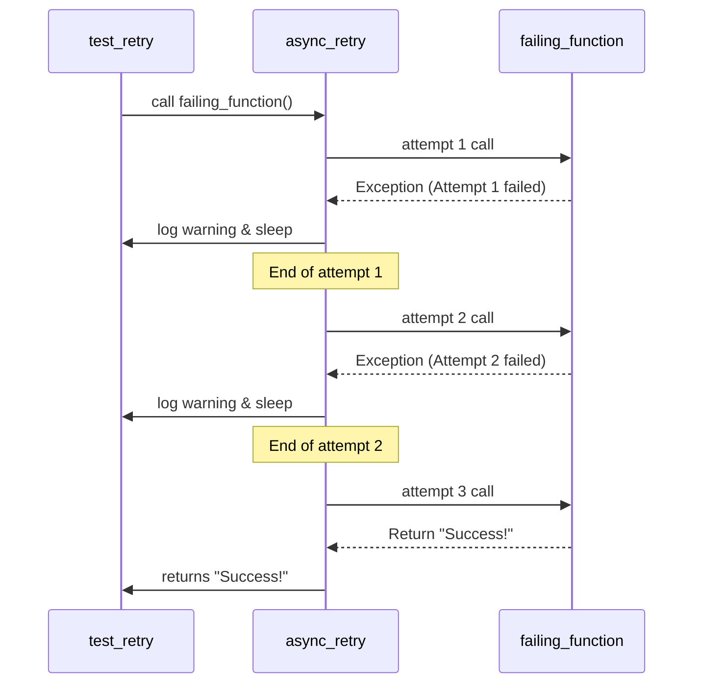

# Utility Functions Module

[code:agent/tools/search/providers/jina.py]

[code:agent/tools/search/providers/searxng.py]

[code:agent/tools/search/providers/brave.py]

[code:agent/tools/search/providers/__init__.py]

[code:agent/tools/search/providers/composite.py]

[code:agent/tools/search/factory.py]

[code:agent/tools/search/base.py]

[code:agent/tools/search/__init__.py]

[code:agent/tools/generators/base_generator.py]

[code:agent/tools/generators/txt_generator.py]

[code:agent/tools/generators/json_generator.py]

[code:agent/tools/generators/__init__.py]

[code:agent/tools/generators/generator_factory.py]

[code:agent/tools/extractors/csv_extractor.py]

[code:agent/tools/extractors/base_extractor.py]

[code:agent/tools/extractors/pdf_extractor.py]

[code:agent/tools/extractors/__init__.py]

[code:agent/tools/extractors/extractor_factory.py]

[code:agent/services/qdrant.py]

[code:agent/services/postgres.py]

[code:agent/services/__init__.py]

[code:agent/reflection/critique.py]

[code:agent/reflection/feedback.py]

[code:agent/reflection/evaluator.py]

[code:agent/reflection/__init__.py]

[code:agent/checkpoints/persistence.py]

[code:agent/checkpoints/recovery.py]

[code:agent/checkpoints/versioning.py]

[code:agent/checkpoints/__init__.py]

[code:agent/utils/langgraph_adapter.py]

[code:agent/utils/extraction.py]

[code:agent/utils/__init__.py]

[code:agent/prompts/validation.py]

[code:agent/prompts/templates.py]

[code:agent/prompts/research.py]

[code:agent/prompts/reflection.py]

[code:agent/prompts/__init__.py]

[code:agent/prompts/analysis.py]

[code:agent/tools/document_processor.py]

[code:agent/tools/code_executor.py]

[code:agent/tools/base.py]

[code:agent/tools/vizualization.py]

[code:agent/tools/human_feedback.py]

[code:agent/tools/scraper.py]

[code:agent/tools/storage.py]

[code:agent/tools/evaluator.py]

[code:agent/tools/__init__.py]

[code:agent/tools/mock_tools.py]

[code:agent/core/state.py]

[code:agent/core/graph.py]

[code:agent/core/agent.py]

[code:agent/core/__init__.py]

[code:agent/cli/visualize.py]

[code:agent/cli/__init__.py]

[code:agent/cli/run.py]

[code:agent/subgraphs/analysis_flow.py]

[code:agent/subgraphs/validation_flow.py]

[code:agent/subgraphs/research_flow.py]

[code:agent/subgraphs/__init__.py]

[code:agent/supervisors/team_supervisor.py]

[code:agent/supervisors/orchestrator.py]

[code:agent/supervisors/__init__.py]

[code:agent/supervisors/task_manager.py]

[code:agent/nodes/market.py]

[code:agent/nodes/validation.py]

[code:agent/nodes/research.py]

[code:agent/nodes/__init__.py]

[code:agent/nodes/analysis.py]

[code:agent/nodes/error.py]

[code:agent/nodes/main.py]

[code:agent/config/settings.py]

[code:agent/config/types.py]

[code:agent/config/__init__.py]

[code:agent/config/configuration.py]

[code:agent/examples/simple_graph.py]

[code:agent/examples/__init__.py]

[code:agent/constants.py]

[code:agent/log_config.py]

[code:agent/exceptions.py]

[code:agent/__init__.py]

## Overview
[code:agent/utils/async_utils.py]
[code:agent/utils/cache.py]
[code:agent/utils/company_extraction.py]
[code:agent/utils/error_handling.py]
[code:agent/utils/http.py]
[code:agent/utils/logging.py]
[code:agent/utils/proxy.py]
[code:agent/utils/retry_stats.py]
The Utility Functions module (`src/agent/utils.py`) provides a collection of helper functions and utilities used throughout the agent system. These functions handle common operations, data transformations, and integration with external systems.

## Primary Responsibilities

1. **Helper Functions**: Providing common utility operations
2. **Data Processing**: Transforming and manipulating data
3. **Error Handling**: Supporting standardized error management
4. **Integration Utilities**: Facilitating interactions with external services
5. **State Manipulation**: Offering helpers for state operations

## Core Components

### Retry Logic

Functions for handling transient failures with retries:

```python
def async_retry(max_retries=3, base_delay=1, max_delay=60, backoff_factor=2):
    """Decorator for retrying async functions with exponential backoff.
    
    This decorator adds retry logic to async functions that might experience
    transient failures, with exponential backoff between attempts.
    
    Args:
        max_retries: Maximum number of retry attempts
        base_delay: Initial delay between retries in seconds
        max_delay: Maximum delay between retries in seconds
        backoff_factor: Factor to increase delay with each retry
        
    Returns:
        Decorated function that will retry on failure
    """
    def decorator(func):
        @functools.wraps(func)
        async def wrapper(*args, **kwargs):
            retries = 0
            delay = base_delay
            
            while True:
                try:
                    return await func(*args, **kwargs)
                except Exception as e:
                    retries += 1
                    if retries > max_retries:
                        # Max retries exceeded, re-raise the exception
                        raise
                        
                    # Calculate delay with exponential backoff
                    delay = min(delay * backoff_factor, max_delay)
                    
                    # Log the failure and retry information
                    logger.warning(
                        f"Function {func.__name__} failed with {type(e).__name__}: {str(e)}. "
                        f"Retrying in {delay} seconds (attempt {retries}/{max_retries})."
                    )
                    
                    # Wait before retrying
                    await asyncio.sleep(delay)
        return wrapper
    return decorator
```

### HTTP Utilities

Functions for making HTTP requests with consistent error handling:

```python
@async_retry(max_retries=3, base_delay=1, max_delay=10)
async def make_http_request(
    url: str,
    method: str = "GET",
    headers: Optional[Dict[str, str]] = None,
    params: Optional[Dict[str, Any]] = None,
    json_data: Optional[Dict[str, Any]] = None,
    timeout: int = 30
) -> Dict[str, Any]:
    """Make an HTTP request with retry logic and error handling.
    
    This function provides a standardized way to make HTTP requests with
    consistent error handling and automatic retries for transient failures.
    
    Args:
        url: The URL to request
        method: HTTP method (GET, POST, etc.)
        headers: Optional HTTP headers
        params: Optional query parameters
        json_data: Optional JSON data for POST/PUT requests
        timeout: Request timeout in seconds
        
    Returns:
        Dict[str, Any]: The response data
        
    Raises:
        HTTPRequestError: For request failures
    """
    try:
        # Set up default headers
        if headers is None:
            headers = {}
            
        if "User-Agent" not in headers:
            headers["User-Agent"] = "Agent/1.0"
            
        # Create timeout
        timeout_obj = aiohttp.ClientTimeout(total=timeout)
        
        # Make the request
        async with aiohttp.ClientSession() as session:
            request_method = getattr(session, method.lower())
            
            async with request_method(
                url,
                headers=headers,
                params=params,
                json=json_data,
                timeout=timeout_obj
            ) as response:
                # Check for success status
                if response.status >= 400:
                    error_text = await response.text()
                    raise HTTPRequestError(
                        f"Request failed with status {response.status}: {error_text}",
                        status_code=response.status,
                        response_text=error_text
                    )
                    
                # Parse the response based on content type
                content_type = response.headers.get("Content-Type", "")
                
                if "application/json" in content_type:
                    return await response.json()
                else:
                    text = await response.text()
                    return {"text": text, "content_type": content_type}
    except aiohttp.ClientError as e:
        # Convert aiohttp exceptions to our custom exception
        raise HTTPRequestError(f"HTTP request failed: {str(e)}")
    except asyncio.TimeoutError:
        raise HTTPRequestError(f"Request timed out after {timeout} seconds")
```

### Data Processing Utilities

Functions for manipulating and transforming data:

```python
def deep_merge(dict1: Dict[str, Any], dict2: Dict[str, Any]) -> Dict[str, Any]:
    """Deep merge two dictionaries.
    
    This function recursively merges the contents of dict2 into dict1,
    handling nested dictionaries properly.
    
    Args:
        dict1: First dictionary (base)
        dict2: Second dictionary (to merge in)
        
    Returns:
        Dict[str, Any]: The merged dictionary
    """
    result = dict1.copy()
    
    for key, value in dict2.items():
        if key in result and isinstance(result[key], dict) and isinstance(value, dict):
            # Recursively merge nested dictionaries
            result[key] = deep_merge(result[key], value)
        else:
            # For non-dict values or keys not in dict1, just use dict2's value
            result[key] = value
            
    return result

def extract_fields(data: Dict[str, Any], schema: Dict[str, Any]) -> Dict[str, Any]:
    """Extract fields from a data dictionary according to a schema.
    
    This function extracts fields from a data dictionary based on a schema
    that specifies field names, types, and default values.
    
    Args:
        data: Source data dictionary
        schema: Schema defining fields to extract
        
    Returns:
        Dict[str, Any]: Extracted and validated data
    """
    result = {}
    
    for field_name, field_schema in schema.items():
        # Get field properties
        field_type = field_schema.get("type", "string")
        default_value = field_schema.get("default")
        required = field_schema.get("required", False)
        
        # Check if field exists in data
        if field_name in data:
            value = data[field_name]
            
            # Validate type
            if field_type == "string" and not isinstance(value, str):
                if required:
                    raise ValueError(f"Field '{field_name}' must be a string")
                value = str(value) if value is not None else default_value
            elif field_type == "integer" and not isinstance(value, int):
                if required:
                    raise ValueError(f"Field '{field_name}' must be an integer")
                try:
                    value = int(value) if value is not None else default_value
                except (ValueError, TypeError):
                    value = default_value
            elif field_type == "number" and not isinstance(value, (int, float)):
                if required:
                    raise ValueError(f"Field '{field_name}' must be a number")
                try:
                    value = float(value) if value is not None else default_value
                except (ValueError, TypeError):
                    value = default_value
            elif field_type == "boolean" and not isinstance(value, bool):
                if required:
                    raise ValueError(f"Field '{field_name}' must be a boolean")
                value = bool(value) if value is not None else default_value
            elif field_type == "array" and not isinstance(value, (list, tuple)):
                if required:
                    raise ValueError(f"Field '{field_name}' must be an array")
                value = list(value) if value is not None else default_value
            elif field_type == "object" and not isinstance(value, dict):
                if required:
                    raise ValueError(f"Field '{field_name}' must be an object")
                value = dict(value) if value is not None else default_value
                
            # Add to result
            result[field_name] = value
        elif required:
            # Field is required but not present
            raise ValueError(f"Required field '{field_name}' is missing")
        else:
            # Field is not required and not present, use default
            result[field_name] = default_value
            
    return result
```

### Text Processing Utilities

Functions for text analysis and manipulation:

```python
def truncate_text(text: str, max_length: int = 1000, suffix: str = "...") -> str:
    """Truncate text to a maximum length.
    
    This function truncates text to stay within a specified length,
    adding a suffix to indicate truncation if needed.
    
    Args:
        text: The text to truncate
        max_length: Maximum length for the result
        suffix: String to append when truncating
        
    Returns:
        str: The truncated text
    """
    if len(text) <= max_length:
        return text
        
    # Account for suffix length
    actual_max = max_length - len(suffix)
    
    # Find a good break point (whitespace)
    breakpoint = actual_max
    while breakpoint > 0 and not text[breakpoint].isspace():
        breakpoint -= 1
        
    # If we couldn't find a good break, just cut at max
    if breakpoint == 0:
        breakpoint = actual_max
        
    return text[:breakpoint] + suffix

def extract_keywords(text: str, max_keywords: int = 10) -> List[str]:
    """Extract important keywords from text.
    
    This function analyzes text to identify and extract key terms
    that represent the main subjects or concepts.
    
    Args:
        text: The text to analyze
        max_keywords: Maximum number of keywords to return
        
    Returns:
        List[str]: Extracted keywords
    """
    # Convert to lowercase and split into words
    words = re.findall(r'\b\w+\b', text.lower())
    
    # Remove stopwords
    stopwords = {'a', 'an', 'the', 'and', 'or', 'but', 'if', 'then', 'else', 'when',
                 'at', 'from', 'by', 'for', 'with', 'about', 'against', 'between',
                 'into', 'through', 'during', 'before', 'after', 'above', 'below',
                 'to', 'of', 'in', 'on', 'is', 'are', 'was', 'were', 'be', 'been',
                 'have', 'has', 'had', 'do', 'does', 'did', 'not', 'this', 'that',
                 'these', 'those', 'they', 'them', 'their', 'what', 'which', 'who',
                 'whom', 'whose', 'when', 'where', 'why', 'how', 'all', 'any',
                 'both', 'each', 'few', 'more', 'most', 'some', 'such', 'no', 'nor',
                 'too', 'very', 'can', 'will', 'just'}
    
    filtered_words = [word for word in words if word not in stopwords and len(word) > 2]
    
    # Count word frequencies
    word_counts = Counter(filtered_words)
    
    # Get most common words
    return [word for word, _ in word_counts.most_common(max_keywords)]
```

### Error Handling Utilities

Decorators and functions for consistent error management:

```python
def handle_agent_errors(func):
    """Decorator for handling errors in agent functions.
    
    This decorator catches exceptions, logs them, and ensures that
    agent functions always return a valid state object.
    
    Args:
        func: The function to wrap
        
    Returns:
        The wrapped function with error handling
    """
    @functools.wraps(func)
    async def wrapper(state: AgentState, *args, **kwargs) -> AgentState:
        try:
            return await func(state, *args, **kwargs)
        except Exception as e:
            # Log the error
            logger.exception(f"Error in {func.__name__}: {str(e)}")
            
            # Ensure we have a valid state to return
            if state is None:
                state = initialize_agent_state(category="error")
                
            # Create a new state to avoid modifying the input
            new_state = create_new_agent_state(state)
            
            # Add error to the state
            error_details = {
                "timestamp": datetime.now().isoformat(),
                "function": func.__name__,
                "message": str(e),
                "error_type": type(e).__name__,
                "traceback": traceback.format_exc()
            }
            
            new_state.errors.append(error_details)
            
            # Update metadata
            new_state.metadata["has_errors"] = True
            new_state.metadata["updated_at"] = datetime.now().isoformat()
            
            return new_state
    return wrapper
```

## Utility Categories

The Utility Functions module provides various categories of utilities for different purposes:

### Data Utilities

Functions for data manipulation and transformation:

| Function | Description |
|----------|-------------|
| `deep_merge` | Recursively merge two dictionaries |
| `extract_fields` | Extract and validate fields according to a schema |
| `flatten_dict` | Flatten nested dictionaries into a single level |
| `unflatten_dict` | Restore flattened dictionaries to nested structure |
| `dict_to_object` | Convert a dictionary to an object with attributes |

### Text Analysis and Manipulation

Functions for text analysis and manipulation:

| Function | Description |
|----------|-------------|
| `truncate_text` | Limit text to a maximum length |
| `extract_keywords` | Identify important keywords in text |
| `calculate_similarity` | Compute similarity between two texts |
| `sanitize_text` | Clean and normalize text |
| `split_into_chunks` | Split text into manageable chunks |

### Network Utilities

Functions for network operations:

| Function | Description |
|----------|-------------|
| `make_http_request` | Make HTTP requests with retry logic |
| `download_file` | Download a file from a URL |
| `parse_url` | Parse URL into components |
| `build_url` | Build a URL from components |
| `encode_query_params` | Encode parameters for URLs |

### Time Utilities

Functions for time manipulation:

| Function | Description |
|----------|-------------|
| `format_timestamp` | Format a timestamp in a specific format |
| `parse_timestamp` | Parse a timestamp string to datetime |
| `get_time_difference` | Calculate time difference between two timestamps |
| `add_time` | Add time to a datetime |
| `is_expired` | Check if a timestamp is expired |

### File Utilities

Functions for file operations:

| Function | Description |
|----------|-------------|
| `read_json_file` | Read and parse a JSON file |
| `write_json_file` | Write data to a JSON file |
| `ensure_directory` | Ensure a directory exists |
| `get_file_hash` | Calculate hash of a file |
| `get_mime_type` | Determine MIME type of a file |

## The Retry Mechanism

A key utility is the retry mechanism, which provides resilience against transient failures:



## Usage Examples

### Using the Retry Decorator

```python
from agent.utils import async_retry

@async_retry(max_retries=3, base_delay=1, max_delay=10)
async def call_external_api(url, params):
    """Call an external API with retry logic."""
    async with aiohttp.ClientSession() as session:
        async with session.get(url, params=params) as response:
            if response.status != 200:
                response.raise_for_status()
            return await response.json()
            
# Usage
try:
    result = await call_external_api("https://api.example.com/data", {"id": "12345"})
    print(f"API call succeeded: {result}")
except Exception as e:
    print(f"API call failed after retries: {str(e)}")
```

### Data Manipulation

```python
from agent.utils import deep_merge, extract_fields

# Merge configuration dictionaries
base_config = {
    "api": {
        "url": "https://api.example.com",
        "timeout": 30
    },
    "features": ["search", "analyze"]
}

override_config = {
    "api": {
        "timeout": 60,
        "retries": 3
    },
    "debug": True
}

# Merge with deep_merge
merged_config = deep_merge(base_config, override_config)
print(merged_config)
# Output: {
#   'api': {
#     'url': 'https://api.example.com',
#     'timeout': 60,
#     'retries': 3
#   },
#   'features': ['search', 'analyze'],
#   'debug': True
# }

# Extract and validate fields using a schema
user_data = {
    "name": "John Doe",
    "age": "30",  # String instead of integer
    "email": "john@example.com"
}

schema = {
    "name": {"type": "string", "required": True},
    "age": {"type": "integer", "required": False},
    "email": {"type": "string", "required": True},
    "role": {"type": "string", "required": False, "default": "user"}
}

# Extract fields with validation and type conversion
extracted = extract_fields(user_data, schema)
print(extracted)
# Output: {
#   'name': 'John Doe',
#   'age': 30,  # Converted to integer
#   'email': 'john@example.com',
#   'role': 'user'  # Default value applied
# }
```

### Text Processing

```python
from agent.utils import truncate_text, extract_keywords

# Truncate long text
long_text = "This is a very long piece of text that needs to be truncated to fit within a specific length limit. It contains many words that exceed our desired length."
truncated = truncate_text(long_text, max_length=50)
print(truncated)
# Output: "This is a very long piece of text that needs to be..."

# Extract keywords from text
article = """
Artificial intelligence and machine learning are transforming how businesses operate in the digital age.
Companies are leveraging these technologies to improve efficiency, reduce costs, and create new products.
The adoption of AI-powered tools continues to accelerate across industries from healthcare to finance.
"""
keywords = extract_keywords(article, max_keywords=5)
print(keywords)
# Output: ['artificial', 'intelligence', 'machine', 'learning', 'businesses']
```

### Error Handling

```python
from agent.utils import handle_agent_errors
from agent.state import AgentState, create_new_agent_state

@handle_agent_errors
async def process_data(state: AgentState, data: Dict[str, Any]) -> AgentState:
    """Process data with error handling."""
    # Create a new state to avoid modifying the input
    new_state = create_new_agent_state(state)
    
    # This might raise exceptions
    processed_data = await some_processing_function(data)
    
    # Update state with processed data
    new_state.processed_results = processed_data
    
    return new_state

# Usage
async def main():
    initial_state = AgentState(category="data_processing")
    
    # Even if processing fails, we'll get a valid state with error information
    result_state = await process_data(initial_state, {"input": "test data"})
    
    if result_state.errors:
        print(f"Processing failed: {result_state.errors[-1]['message']}")
    else:
        print("Processing succeeded")
```

## Best Practices

1. **Function Purity**: Design utility functions to be pure when possible
2. **Error Handling**: Implement robust error handling in all utilities
3. **Documentation**: Provide clear docstrings for all utility functions
4. **Type Annotations**: Use type hints for better code understanding
5. **Validation**: Validate inputs to prevent issues with invalid data
6. **Testing**: Create comprehensive tests for utility functions
7. **Performance**: Optimize for performance where appropriate
8. **Logging**: Include appropriate logging for diagnostic purposes
9. **Modularity**: Keep utilities focused on a single responsibility
10. **Reusability**: Design for reuse across different parts of the system

## Related Components

- **Graph Engine**: Uses utilities for state manipulation and error handling
- **Agent Tools**: Leverages HTTP and data processing utilities
- **State Management**: Uses data utilities for state operations
- **Configuration Module**: Uses file and data utilities
- **Prompt Management**: Incorporates text processing utilities
